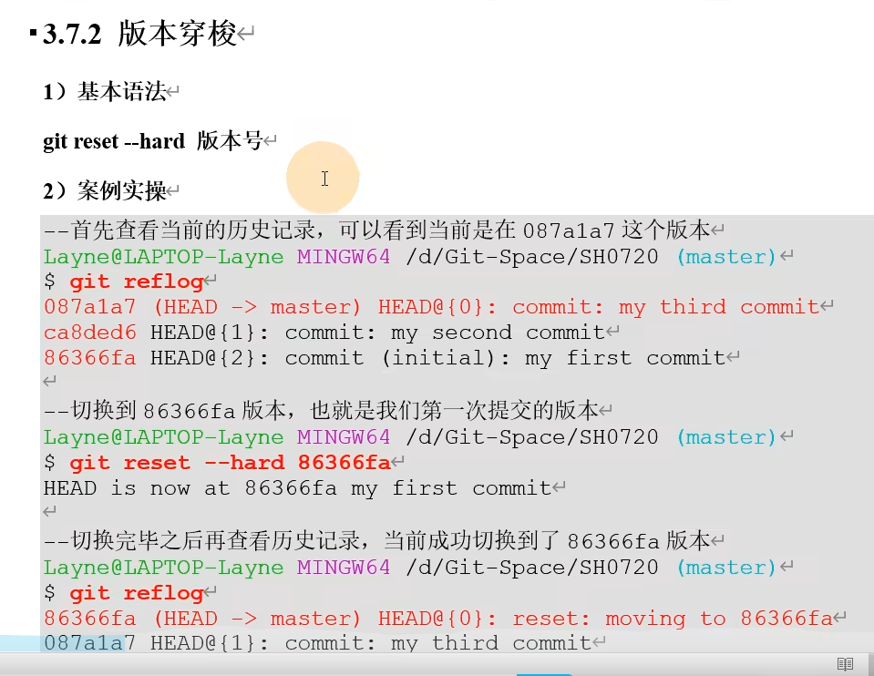

<!-- @import "[TOC]" {cmd="toc" depthFrom=1 depthTo=6 orderedList=false} -->

<!-- code_chunk_output -->

- [一、Git](#一git)
  - [1.介绍](#1介绍)
    - [工作机制](#工作机制)
    - [Git和代码托管中心](#git和代码托管中心)
  - [2.Git的安装](#2git的安装)
  - [3.Git的命令](#3git的命令)
    - [(1)设置用户签名(安装后首次使用git必须设置)](#1设置用户签名安装后首次使用git必须设置)
      - [验证设置成功：](#验证设置成功)
    - [(2)初始化本地库](#2初始化本地库)
    - [(3)查看本地库状态](#3查看本地库状态)
    - [(4)添加到暂存区](#4添加到暂存区)
    - [(5)提交到本地库](#5提交到本地库)
    - [(6)修改文件](#6修改文件)
    - [(7)历史版本](#7历史版本)
  - [4.Git的分支](#4git的分支)
  - [5.idea集成Git](#5idea集成git)
    - [(1)配置git忽略文件](#1配置git忽略文件)
- [二、GitHub](#二github)
  - [1.git团队协作](#1git团队协作)
    - [(1)团队内协作](#1团队内协作)
    - [(2)跨团队协作](#2跨团队协作)
  - [2.创建远程库](#2创建远程库)
  - [3.代码推送Push](#3代码推送push)
  - [4.代码拉取Pull](#4代码拉取pull)
  - [5.代码克隆Clone(不需要登录账号)](#5代码克隆clone不需要登录账号)
  - [6.SSH免密登录](#6ssh免密登录)
    - [(1)系统盘对应的用户文件夹内添加.ssh文件夹并获取公钥](#1系统盘对应的用户文件夹内添加ssh文件夹并获取公钥)
    - [(2)授权到对应的github账户中](#2授权到对应的github账户中)
  - [7.Idea集成GitHub](#7idea集成github)
- [三、Gitee码云](#三gitee码云)
  - [1.码云创建远程库](#1码云创建远程库)
  - [2.Idea集成Gitee码云](#2idea集成gitee码云)
  - [3.码云连接Github 进行代码的复制和迁移](#3码云连接github-进行代码的复制和迁移)
- [四、GitLab](#四gitlab)
  - [1.GitLab服务器的搭建和部署](#1gitlab服务器的搭建和部署)
  - [2.Idea集成GitLab](#2idea集成gitlab)

<!-- /code_chunk_output -->

# 一、Git
## 1.介绍
>>- Git是一个免费的、开源的分布式版本控制系统
### 工作机制
>>>- 
### Git和代码托管中心
>>>- 
## 2.Git的安装
>>- 安装目录必须为纯英文
>>- 
>>- 
>>- 
>>- 
>>- 
>>- 
>>- 
>>- 
## 3.Git的命令
>>- 
### (1)设置用户签名(安装后首次使用git必须设置)
>>>- 
#### 验证设置成功：
>>>>-打开系统盘，打开用户文件夹，在对应的用户文件夹下找到并打开.gitconfig文件,查看设置的签名是否正确
### (2)初始化本地库
>>>- 在想要管理的项目目录下使用Git Bash Here，并在指令行窗口内输入"git init"初始化命令，即可初始化此项目的本地库
>>>>- 
### (3)查看本地库状态
>>>- 在想要管理的项目目录下使用Git Bash Here，并在指令行窗口内输入"git status"命令，即可查看此项目的本地库状态
>>>>- 
### (4)添加到暂存区
>>>- 在想要管理的项目目录下使用Git Bash Here，并在指令行窗口内输入"git add 文件名.文件名后缀"命令，即可将此项目的被选中的文件或文件夹添加到暂存区
>>>>- 
>>>- 在想要管理的项目目录下使用Git Bash Here，并在指令行窗口内输入"git rm --cache 文件名.文件名后缀"命令(如果删除的是文件夹，则需要在--cache前添加 -r 参数)，即可将此项目的暂存区中被选中的文件或文件夹删除
>>>>- 
### (5)提交到本地库
>>>- 
>>>- 可通过"git reflog"命令查看提交的版本引用日志信息
>>>- 可通过"git log"命令查看提交的版本详细日志信息
>>>>- 
### (6)修改文件
>>>- [1]查看状态(检测到工作区有文件被修改)
>>>- [2]将修改的文件再次添加到暂存区
>>>- [3]查看状态(工作区的修改添加到了暂存区)
>>>- [4]再次提交到本地库
>>>>- 
>>>>- 
### (7)历史版本
>>>- [1]查看历史记录
>>>>- 可通过"git reflog"命令查看提交的版本引用日志信息
>>>>- 可通过"git log"命令查看提交的版本详细日志信息
>>>- [2]版本穿梭
>>>>- 
##  4.Git的分支
>>- 
>>- 分支正常合并
>>- 分支冲突合并
##  5.idea集成Git
### (1)配置git忽略文件
>>>- 
>>>- 在系统盘对应的用户文件夹内创建git.ignore文件，并将以下内容粘贴进去

    # Compiled class file
    *.class
    
    # Log file
    *.log
    
    # BlueJ files
    *.ctxt
    
    # Mobile Tools for Java (J2ME)
    .mtj.tmp/# Package Files #
    *.jar
    *.war
    *.nar
    *.ear
    *.zip
    *.tar.gz
    *.rar
    
    hs_err_pid*
    
    .classpath
    .project
    .settings
    target
    .idea
    *.iml
>>>- 在系统盘对应的用户文件夹内的.gitconfig文件里引用git.ignore文件(路径名需要使用正斜线/，不能使用反斜线\)
    
    [core]
        excludesfile=git.ignore文件路径
>>>- 在idea里定位git程序
>>>>- 打开idea
>>>>- 打开设置(settings)-->版本控制(Version Control)-->Git-->Path to Git executable
>>>>- 填写git的安装目录下：bin文件夹-->git.exe
>>>>- 版本控制初始化：打开需要使用的项目，点击窗口上方VCS-->导入版本控制(import into Version Control)-->创建git存储库(Create Git Repository)-->选择项目根目录-->确定(ok)-->版本控制初始化完成
>>>>- 添加到暂存区：工作区对需要添加的文件夹或文件右键：Git-->add(添加)
>>>>- 提交到本地库：工作区对需要提交的文件夹或文件右键：Git-->commit(提交)-->Commit Changes-->填写提交的信息-->Commit
>>>>- 切换版本：
>>>>>- 查看版本信息：点击编辑器左下角版本控制(Version Control)[版本不同可能为git]-->日志(log)-->找到对应的版本
>>>>>- 切换历史版本：找到对应的版本-->右键选择签出修订'版本号'
>>>>- 创建分支/切换分支/合并分支
>>>>>- 创建分支：工作区对需要使用的文件夹或文件右键：Git-->存储库(Repository)-->分支(Branches)-->创建分支(New Branch)-->填写分支名-->勾选是否切换分支(CheckOut branch)
>>>>>- 切换分支：点击编辑器右下角分支名-->选择想要的分支-->切换(CheckOut)
>>>>>- 合并分支
>>>>>>- 正常合并：切换到想要合并的分支后-->点击编辑器右下角分支名-->选择想要的分支-->合并到当前分支(Merge into Current)
>>>>>>- 冲突合并：切换到想要合并的分支后-->点击编辑器右下角分支名-->选择想要的分支-->合并到当前分支(Merge into Current)-->冲突(Conflicts)-->合并(Merge)-->手动合并需要的代码-->应用(apply)
# 二、GitHub
>- 
## 1.git团队协作
### (1)团队内协作
>>>- 
### (2)跨团队协作
>>>- 
## 2.创建远程库
>>- (1)登录github
>>- (2)点击右上角+号，点击New repository
>>- (3)填写远程库名字(最好与工作区的项目名一致)
>>- (4)选择库的权限(公共Public/私有Private)
>>- (5)点击Create repository创建库
>>- (6)创建远程库别名
>>>- 
## 3.代码推送Push
>>>- 
## 4.代码拉取Pull
>>- ##指令"git pull 别名 分支"
## 5.代码克隆Clone(不需要登录账号)
>>- ##指令"git clone 别名 分支"
>>- 
## 6.SSH免密登录
### (1)系统盘对应的用户文件夹内添加.ssh文件夹并获取公钥
>>>- 在系统盘对应的用户文件夹内右键点击Git Bash Here，输入指令"ssh-keygen -t rsa -C github邮箱地址",提交指令并敲三次回车
>>>- 进入.ssh文件夹，右键点击Git Bash Here，输入指令"cat id_rsa.pub"，提交指令即可获得对应的公钥
### (2)授权到对应的github账户中
>>>- 将公钥复制，粘贴到github账户设置的"SSH and GPG keys"里
## 7.Idea集成GitHub
>>- 在idea中添加github账号：打开idea-->设置(settings)-->版本控制(Version Control)-->GitHub-->点击右上角+号登录git账号-->Use Token(使用口令方式)-->打开github，进入个人账户settings，点击Developer settings(开发人员设置)，点击Personal access tokens，点击Generate new token，填写Note,勾选全部权限，点击Generate token,复制绿色√后的口令-->粘贴到idea的Token中-->Log in-->确定
>>- 分享项目到GitHub(在github上创建此工程的库)：点击idea上方VCS-->导入到版本控制(Import into Version Control)-->Share Project on GitHub-->填写远程库名(Repository name)，别名(remote)
>>- 推送代码到远程库：添加到暂存区-->提交到本地库-->工作区右键项目-->Git-->存储库(Repository)-->推送(push)-->使用SSH连接推送-->在github对应的库复制SSH连接-->在推送窗口的库右键-->定义远程(Define Remote)-->填写名字，粘贴SSH连接-->确定-->点击在推送窗口的库名，选择设置的SSH连接-->推送(Push)
>>- 拉取远程库代码到本地：点击上方VCS-->Git-->拉取(Pull)-->拉取变更(Pull Changes)-->选择连接方式(远程)-->Branches to merge(选择合并的分支)-->Pull
>>>- 
>>- 
>>- 克隆代码到本地：在idea欢迎界面点击右边的"从版本控制中获取"(Get from Version Control)-->Version Control:git,URL:想要克隆的库的SSH或HTTPS连接,Directory:项目克隆下来存放的位置-->Clone-->Yes

# 三、Gitee码云
## 1.码云创建远程库
## 2.Idea集成Gitee码云
>>- 需要在idea内安装gitee插件
>>- 在settings设置里-->版本控制--> Gitee-->添加账户 -->use token--> 到码云里生成令牌-->粘贴进idea即可
## 3.码云连接Github 进行代码的复制和迁移
>>- 在码云网页点击新建仓库-->导入已有仓库-->填写github仓库连接(https协议)-->创建
>>- github项目更新后，需要在码云里手动更新项目

# 四、GitLab
## 1.GitLab服务器的搭建和部署
## 2.Idea集成GitLab