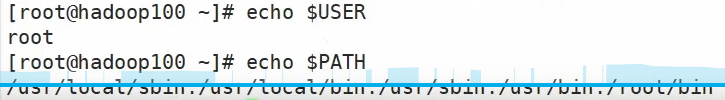
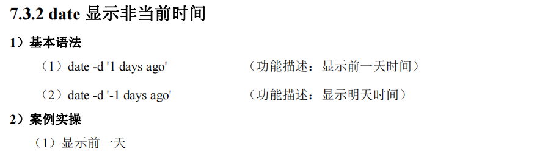
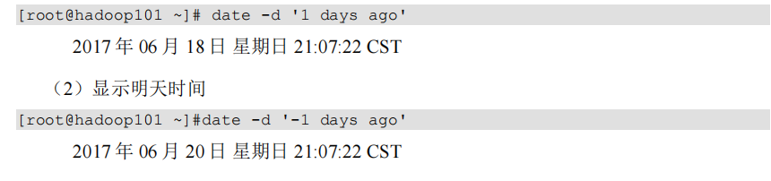
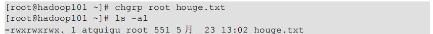
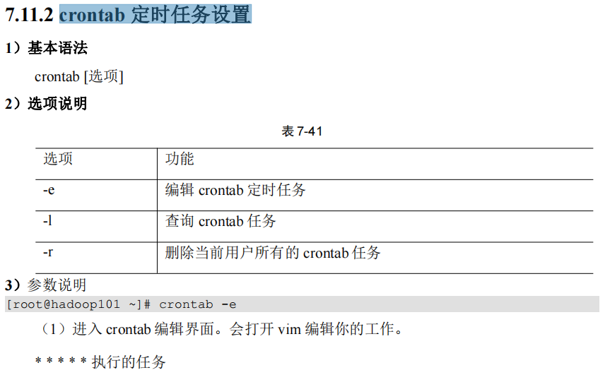
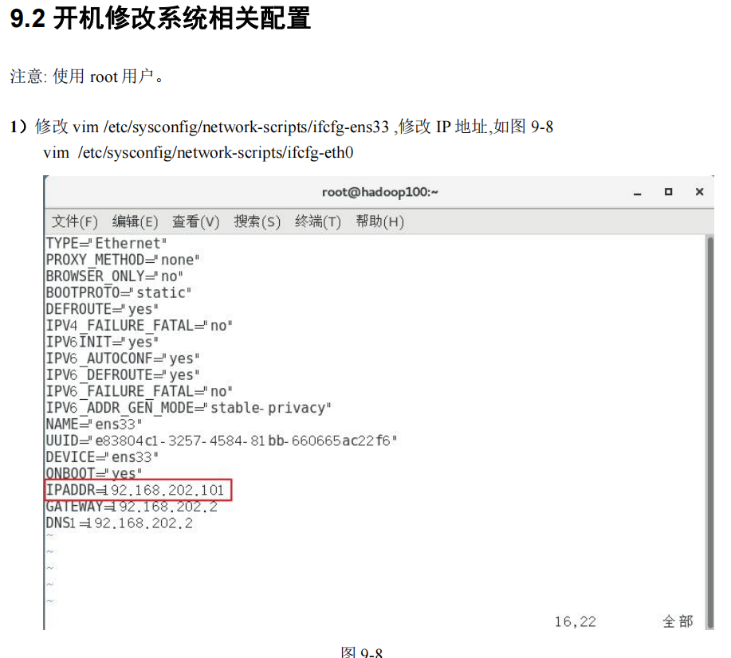
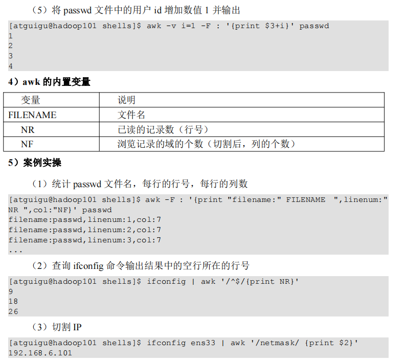

<!-- @import "[TOC]" {cmd="toc" depthFrom=1 depthTo=6 orderedList=false} -->

<!-- code_chunk_output -->

- [入门篇](#入门篇)
  - [概述](#概述)
  - [安装](#安装)
    - [下载CentOS](#下载centos)
    - [下载VMware](#下载vmware)
      - [安装VMware](#安装vmware)
      - [创建虚拟机](#创建虚拟机)
    - [安装CentOS](#安装centos)
- [基础篇](#基础篇)
  - [文件与目录结构](#文件与目录结构)
  - [VI/VIM编辑器](#vivim编辑器)
    - [一般模式](#一般模式)
    - [编辑模式](#编辑模式)
    - [命令模式](#命令模式)
  - [网络配置](#网络配置)
    - [配置静态ip](#配置静态ip)
    - [配置主机名](#配置主机名)
      - [修改主机名](#修改主机名)
      - [修改主机名和ip的对应关系](#修改主机名和ip的对应关系)
      - [配置成功](#配置成功)
  - [远程登录](#远程登录)
    - [SSH方式(需开启ssh服务)](#ssh方式需开启ssh服务)
      - [窗口化工具XShell7和Xftp7](#窗口化工具xshell7和xftp7)
  - [系统管理](#系统管理)
    - [Linux服务管理](#linux服务管理)
    - [系统运行级别](#系统运行级别)
    - [配置服务开机自启动和关闭防火墙](#配置服务开机自启动和关闭防火墙)
    - [关机重启](#关机重启)
- [实操篇](#实操篇)
  - [内置命令](#内置命令)
  - [文件目录类](#文件目录类)
    - [pwd显示当前工作目录的绝对路径](#pwd显示当前工作目录的绝对路径)
    - [ls列出目录的内容](#ls列出目录的内容)
    - [cd切换目录](#cd切换目录)
    - [mkdir创建一个新目录](#mkdir创建一个新目录)
    - [rmdir删除一个空的目录\&touch创建空的文件](#rmdir删除一个空的目录touch创建空的文件)
    - [cp复制文件或目录](#cp复制文件或目录)
    - [rm删除文件或目录](#rm删除文件或目录)
    - [mv移动文件与目录或重命名](#mv移动文件与目录或重命名)
    - [cat查看文件内容](#cat查看文件内容)
    - [more文件内容分屏查看器](#more文件内容分屏查看器)
    - [less分屏显示文件内容](#less分屏显示文件内容)
    - [echo输出内容到控制台](#echo输出内容到控制台)
    - [head显示文件头部内容](#head显示文件头部内容)
    - [tail输出文件尾部内容](#tail输出文件尾部内容)
    - [\>输出重定向和\>\>追加](#输出重定向和追加)
    - [In软连接](#in软连接)
    - [history查看已经执行过历史命令](#history查看已经执行过历史命令)
  - [时间日期类](#时间日期类)
    - [date显示当前时间](#date显示当前时间)
    - [date显示非当前时间](#date显示非当前时间)
    - [date设置系统时间](#date设置系统时间)
      - [联网校准时间](#联网校准时间)
    - [cal查看日历](#cal查看日历)
  - [用户管理类](#用户管理类)
    - [添加新用户](#添加新用户)
    - [更改用户名对应的文件夹的名字](#更改用户名对应的文件夹的名字)
    - [更改或设置密码](#更改或设置密码)
    - [查看用户是否存在](#查看用户是否存在)
    - [查看创建了哪些用户](#查看创建了哪些用户)
    - [切换用户](#切换用户)
    - [删除用户](#删除用户)
    - [查看登录用户的信息](#查看登录用户的信息)
    - [sudo 设置普通用户具有root权限](#sudo-设置普通用户具有root权限)
    - [usermod修改用户](#usermod修改用户)
    - [用户组管理](#用户组管理)
    - [groupadd新增组](#groupadd新增组)
    - [groupdel删除组](#groupdel删除组)
    - [groupmod修改组](#groupmod修改组)
    - [cat /etc/group 查看创建了哪些组](#cat-etcgroup-查看创建了哪些组)
  - [文件权限类](#文件权限类)
    - [文件属性](#文件属性)
    - [chmod 改变权限](#chmod-改变权限)
    - [chown 改变所有者](#chown-改变所有者)
    - [chgrp 改变所属组](#chgrp-改变所属组)
  - [搜索查找类](#搜索查找类)
    - [find 查找文件或者目录](#find-查找文件或者目录)
    - [locate 快速定位文件路径](#locate-快速定位文件路径)
    - [grep 过滤查找及“|”管道符](#grep-过滤查找及管道符)
  - [压缩解压类](#压缩解压类)
    - [gzip/gunzip 压缩](#gzipgunzip-压缩)
    - [zip/unzip 压缩](#zipunzip-压缩)
    - [tar 打包](#tar-打包)
  - [磁盘分区类](#磁盘分区类)
    - [du 查看文件和目录占用的磁盘空间](#du-查看文件和目录占用的磁盘空间)
    - [df 查看磁盘空间使用情况](#df-查看磁盘空间使用情况)
    - [lsblk 查看设备挂载情况](#lsblk-查看设备挂载情况)
    - [mount/umount 挂载/卸载](#mountumount-挂载卸载)
    - [fdisk 分区](#fdisk-分区)
  - [进程管理类](#进程管理类)
    - [ps 查看当前系统进程状态](#ps-查看当前系统进程状态)
    - [kill 终止进程](#kill-终止进程)
    - [pstree 查看进程树](#pstree-查看进程树)
    - [top 实时监控系统进程状态](#top-实时监控系统进程状态)
    - [netstat 显示网络状态和端口占用信息](#netstat-显示网络状态和端口占用信息)
  - [crontab 系统定时任务](#crontab-系统定时任务)
    - [crontab 服务管理](#crontab-服务管理)
    - [crontab 定时任务设置](#crontab-定时任务设置)
- [扩展篇](#扩展篇)
  - [软件包管理](#软件包管理)
    - [RPM](#rpm)
      - [概述](#概述-1)
      - [RPM 查询命令（rpm -qa）](#rpm-查询命令rpm--qa)
      - [RPM 卸载命令（rpm -e）](#rpm-卸载命令rpm--e)
      - [RPM 安装命令（rpm -ivh）](#rpm-安装命令rpm--ivh)
    - [YUM 仓库配置](#yum-仓库配置)
      - [YUM 概述](#yum-概述)
      - [YUM 的常用命令](#yum-的常用命令)
      - [修改网络 YUM 源](#修改网络-yum-源)
  - [克隆虚拟机](#克隆虚拟机)
    - [克隆](#克隆)
    - [开机修改系统相关配置](#开机修改系统相关配置)
  - [Shell编程](#shell编程)
    - [概述](#概述-2)
    - [Shell脚本入门](#shell脚本入门)
    - [变量](#变量)
      - [系统预定义变量](#系统预定义变量)
      - [自定义变量](#自定义变量)
      - [特殊变量](#特殊变量)
        - [$n](#n)
        - [$#](#)
        - [$\*、$@](#-1)
        - [$?](#-2)
    - [运算符](#运算符)
    - [条件判断](#条件判断)
    - [流程控制](#流程控制)
      - [if 判断](#if-判断)
      - [case 语句](#case-语句)
      - [for 循环](#for-循环)
      - [while 循环](#while-循环)
    - [read读取控制台输出](#read读取控制台输出)
    - [函数](#函数)
      - [系统函数](#系统函数)
        - [basename](#basename)
        - [dirname](#dirname)
      - [自定义函数](#自定义函数)
    - [正则表达式入门](#正则表达式入门)
      - [常规匹配](#常规匹配)
      - [常用特殊字符](#常用特殊字符)
    - [文本处理工具](#文本处理工具)
      - [cut](#cut)
      - [awk](#awk)

<!-- /code_chunk_output -->
# 入门篇
## 概述
>>
>>
>>
>>
>>
>>
## 安装
### 下载CentOS
### 下载VMware
#### 安装VMware
#### 创建虚拟机
### 安装CentOS
# 基础篇
## 文件与目录结构
>>
>>
## VI/VIM编辑器
>>
>>
>>
### 一般模式
>>>
>>>
### 编辑模式
>>>
### 命令模式
>>>
>>>
## 网络配置
>>
>>
### 配置静态ip
>>>
>> ---
>>>
>> ---
>>>
>> ---
>>>
### 配置主机名
#### 修改主机名
>>>>
#### 修改主机名和ip的对应关系
>>>>
>>>---
>>>>
    到Windows系统里修改对应的配置文件(C:\Windows\System32\drivers\etc\hosts)
    将此内容粘贴到文件内并保存(使用文本文件去除后缀后替换)
    
#### 配置成功
>>>>
## 远程登录
>>
### SSH方式(需开启ssh服务)
>>>
#### 窗口化工具XShell7和Xftp7
## 系统管理
### Linux服务管理
>>>
>>>
>>>
### 系统运行级别
>>>
>> ---
>>>
>>>
>>>
>>>
>>>
>> ---
>>>
### 配置服务开机自启动和关闭防火墙
>>>
>>>
>>>
>>>
### 关机重启
>>>
>>>
>>>
# 实操篇
>
> eg：调出关于ls的命令手册
>
---
## 内置命令
>>
>>
## 文件目录类
### pwd显示当前工作目录的绝对路径
>>>
### ls列出目录的内容
>>>
### cd切换目录
>>>
### mkdir创建一个新目录
>>>
### rmdir删除一个空的目录&touch创建空的文件
>>>
### cp复制文件或目录
>>>
>>>
>>>
### rm删除文件或目录
>>>
>>>
### mv移动文件与目录或重命名
>>>
### cat查看文件内容
>>>
### more文件内容分屏查看器
>>>
>>>
>>>
### less分屏显示文件内容
>>
### echo输出内容到控制台
>>>
>>>
>>>
### head显示文件头部内容
>>>
### tail输出文件尾部内容
>>>
### >输出重定向和>>追加
>>>
>>>
### In软连接
>>>
### history查看已经执行过历史命令
>>>
## 时间日期类
>>
### date显示当前时间
>>>
>>>
### date显示非当前时间
>>>
>>>
### date设置系统时间
>>>
#### 联网校准时间
>>>>
### cal查看日历
>>>
## 用户管理类
### 添加新用户
>>>
### 更改用户名对应的文件夹的名字
>>>
### 更改或设置密码
>>>
### 查看用户是否存在
>>>
### 查看创建了哪些用户
>>>
### 切换用户
>>>
>>> #### eg:
>>>
### 删除用户
>>>
>>>
### 查看登录用户的信息
>>>
### sudo 设置普通用户具有root权限
>>>
>>>
### usermod修改用户
>>>
>>>
### 用户组管理
>>>
### groupadd新增组
>>>
### groupdel删除组
>>>
### groupmod修改组
>>>
>>>
### cat /etc/group 查看创建了哪些组
>>>
## 文件权限类
### 文件属性
>>>
>>>
>>>
### chmod 改变权限
>>>
>>>
### chown 改变所有者
>>>
### chgrp 改变所属组
>>>
>>>
## 搜索查找类
### find 查找文件或者目录
>>>
### locate 快速定位文件路径
>>>
>>>
### grep 过滤查找及“|”管道符
>>>
## 压缩解压类
### gzip/gunzip 压缩
>>>
### zip/unzip 压缩
>>>
>>>
>>>
### tar 打包
>>>
>>>
## 磁盘分区类
### du 查看文件和目录占用的磁盘空间
>>>
### df 查看磁盘空间使用情况
>>>
>>>
### lsblk 查看设备挂载情况
>>>
### mount/umount 挂载/卸载
>>>
>>>
>>>
>>>
>>>
>>>
>>>
### fdisk 分区
>>>
>>>
>>>
>>>
## 进程管理类
>>
### ps 查看当前系统进程状态
>>>
>>>
>>>
>>>
>>>
### kill 终止进程
>>>
### pstree 查看进程树
>>>
### top 实时监控系统进程状态
>>>
>>>
>>>
>>>
>>>
>>>
### netstat 显示网络状态和端口占用信息
>>>
>>>
## crontab 系统定时任务
### crontab 服务管理
>>>
### crontab 定时任务设置
>>>
>>>
>>>
>>>
>>>
>>>
# 扩展篇
## 软件包管理
### RPM
#### 概述
>>>>
#### RPM 查询命令（rpm -qa）
>>>>
#### RPM 卸载命令（rpm -e）
>>>>
>>>>
#### RPM 安装命令（rpm -ivh）
>>>>
### YUM 仓库配置
#### YUM 概述
>>>>
>>>>
#### YUM 的常用命令
>>>>
>>>>
#### 修改网络 YUM 源
>>>>
>>>>
## 克隆虚拟机
### 克隆
>>>
>>>
>>>
>>>
>>>
>>>
>>>
>>>
### 开机修改系统相关配置
>>>
>>>
>>>
## Shell编程
### 概述
>>>
>>>
### Shell脚本入门
>>>
>>>
>>>
>>>
>>>
### 变量
#### 系统预定义变量
>>>>
#### 自定义变量
>>>>
>>>>
>>>>
>>>>
>>>>
#### 特殊变量
##### $n
>>>>>
##### $#
>>>>>
>>>>>
##### $*、$@
>>>>>
##### $?
>>>>>
### 运算符
>>>
>>>
### 条件判断
>>>
>>>
>>>
### 流程控制
#### if 判断
>>>>
>>>>
>>>>
#### case 语句
>>>>
>>>>
>>>>
#### for 循环
>>>>
>>>>
>>>>
>>>>
>>>>
#### while 循环
>>>>
### read读取控制台输出
>>>
>>>
### 函数
#### 系统函数
##### basename
>>>>>
##### dirname
>>>>>
#### 自定义函数
>>>>>
>>>>>
### 正则表达式入门
>>>
#### 常规匹配
>>>>
#### 常用特殊字符
>>>>
>>>>
>>>>
### 文本处理工具
>>>
#### cut
>>>>
>>>>
>>>>
#### awk
>>>>
>>>>
>>>>
>>>>