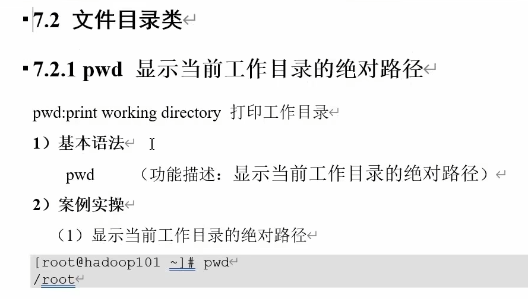

[toc]
# 入门篇
## 概述
>>
>>
>>
>>
>>
>>
## 安装
### 下载CentOS
### 下载VMware
#### 安装VMware
#### 创建虚拟机
### 安装CentOS
# 基础篇
## 文件与目录结构
>>
>>
## VI/VIM编辑器
>>
>>
>>
### 一般模式
>>>
>>>
### 编辑模式
>>>
### 命令模式
>>>
>>>
## 网络配置
>>
>>
### 配置静态ip
>>>
>> ---
>>>
>> ---
>>>
>> ---
>>>
### 配置主机名
#### 修改主机名
>>>>
#### 修改主机名和ip的对应关系
>>>>
>>>---
>>>>
    到Windows系统里修改对应的配置文件(C:\Windows\System32\drivers\etc\hosts)
    将此内容粘贴到文件内并保存(使用文本文件去除后缀后替换)
    
#### 配置成功
>>>>
## 远程登录
>>
### SSH方式(需开启ssh服务)
>>>
#### 窗口化工具XShell7和Xftp7
## 系统管理
### Linux服务管理
>>>
>>>
>>>
### 系统运行级别
>>>
>> ---
>>>
>>>
>>>
>>>
>>>
>> ---
>>>
### 配置服务开机自启动和关闭防火墙
>>>
>>>
>>>
>>>
### 关机重启
>>>
>>>
>>>
# 实操篇
>
> eg：调出关于ls的命令手册
>
---
## 内置命令
>>
>>
## 文件目录类
### pwd显示当前工作目录的绝对路径
>>>
### ls列出目录的内容
>>>
### cd切换目录
>>>
### mkdir创建一个新目录
>>>
### rmdir删除一个空的目录&touch创建空的文件
>>>
### cp复制文件或目录
>>>
>>>
>>>
### rm删除文件或目录
>>>
>>>
### mv移动文件与目录或重命名
>>>
### cat查看文件内容
>>>
### more文件内容分屏查看器
>>>
>>>
>>>
### less分屏显示文件内容
>>
### echo输出内容到控制台
>>>
>>>
>>>
### head显示文件头部内容
>>>
### tail输出文件尾部内容
>>>
### >输出重定向和>>追加
>>>
>>>
### In软连接
>>>
### history查看已经执行过历史命令
>>>
## 时间日期类
>>
### date显示当前时间
>>>
>>>
### date显示非当前时间
>>>
>>>
### date设置系统时间
>>>
#### 联网校准时间
>>>>
### cal查看日历
>>>
## 用户管理类
### 添加新用户
>>>
### 更改用户名对应的文件夹的名字
>>>
### 更改或设置密码
>>>
### 查看用户是否存在
>>>
### 查看创建了哪些用户
>>>
### 切换用户
>>>
>>> #### eg:
>>>
### 删除用户
>>>
>>>
### 查看登录用户的信息
>>>
### sudo 设置普通用户具有root权限
>>>
>>>
### usermod修改用户
>>>
>>>
### 用户组管理
>>>
### groupadd新增组
>>>
### groupdel删除组
>>>
### groupmod修改组
>>>
>>>
### cat /etc/group 查看创建了哪些组
>>>
## 文件权限类
### 文件属性
>>>
>>>
>>>
### chmod 改变权限
>>>
>>>
### chown 改变所有者
>>>
### chgrp 改变所属组
>>>
>>>
## 搜索查找类
### find 查找文件或者目录
>>>
### locate 快速定位文件路径
>>>
>>>
### grep 过滤查找及“|”管道符
>>>
## 压缩解压类
### gzip/gunzip 压缩
>>>
### zip/unzip 压缩
>>>
>>>
>>>
### tar 打包
>>>
>>>
## 磁盘分区类
### du 查看文件和目录占用的磁盘空间
>>>
### df 查看磁盘空间使用情况
>>>
>>>
### lsblk 查看设备挂载情况
>>>
### mount/umount 挂载/卸载
>>>
>>>
>>>
>>>
>>>
>>>
>>>
### fdisk 分区
>>>
>>>
>>>
>>>
## 进程线程类
# 扩展篇
## 软件包管理
## 克隆虚拟机
## Shell编程