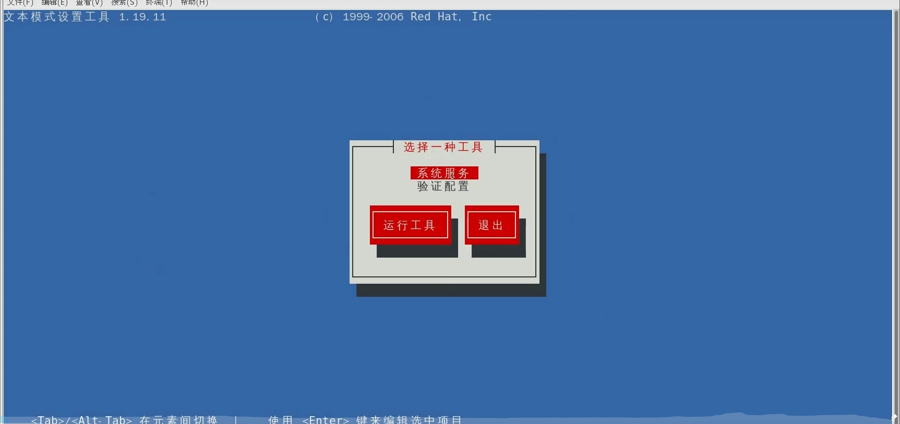

[toc]
# 入门篇
## 概述
>>
>>
>>
>>
>>
>>
## 安装
### 下载CentOS
### 下载VMware
#### 安装VMware
#### 创建虚拟机
### 安装CentOS
# 基础篇
## 文件与目录结构
>>
>>
## VI/VIM编辑器
>>
>>
>>
### 一般模式
>>>
>>>
### 编辑模式
>>>
### 命令模式
>>>
>>>
## 网络配置
>>
>>
### 配置静态ip
>>>
>> ---
>>>
>> ---
>>>
>> ---
>>>
### 配置主机名
#### 修改主机名
>>>>
#### 修改主机名和ip的对应关系
>>>>
>>>---
>>>>
    到Windows系统里修改对应的配置文件(C:\Windows\System32\drivers\etc\hosts)
    将此内容粘贴到文件内并保存(使用文本文件去除后缀后替换)
    
#### 配置成功
>>>>
## 远程登录
>>
### SSH方式(需开启ssh服务)
>>>
#### 窗口化工具XShell7和Xftp7
## 系统管理
### Linux服务管理
>>>
>>>
>>>
### 系统运行级别
>>>
>> ---
>>>
>>>
>>>
>>>
>>>
### 配置服务开机自启动和关闭防火墙
# 实操篇
## 文件目录类
## 时间日期类
## 用户管理类
## 文件权限类
## 磁盘分区类
## 进程线程类
# 扩展篇
## 软件包管理
## 克隆虚拟机
## Shell编程