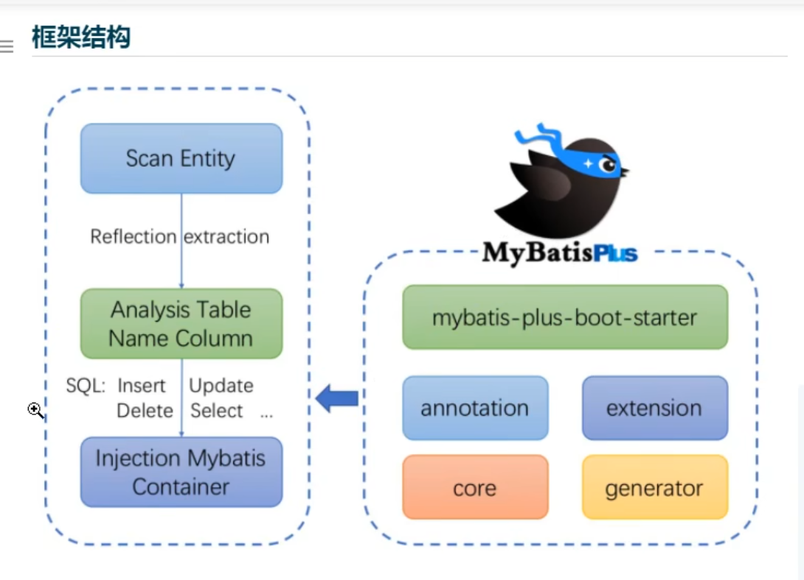

#一、框架结构
> 
#二、代码和文档地址
> 
#三、快速配置
>- ##创建一个SpringBoot工程
>- ##导入依赖
>>      <!--MyBatis-Plus依赖-->
>>      <dependency>
>>          <groupId>com.baomidou</groupId>
>>          <artifactId>mybatis-plus-boot-starter</artifactId>
>>          <version>3.5.1</version>
>>      </dependency>
>>      <!--Lombok依赖,使用此依赖需安装lombok插件-->
>>      <dependency>
>>          <groupId>org.projectlombok</groupId>
>>          <artifactId>lombok</artifactId>
>>          <optional>true</optional>
>>      </dependency>
>>      <!--MySQL依赖-->
>>      <dependency>
>>          <groupId>mysql</groupId>
>>          <artifactId>mysql-connector-java</artifactId>
>>          <scope>runtime</scope>
>>      </dependency>