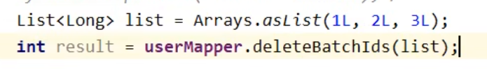
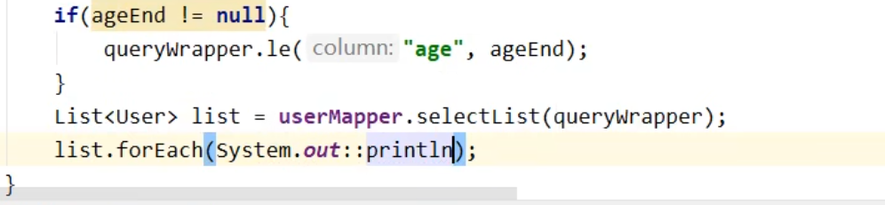
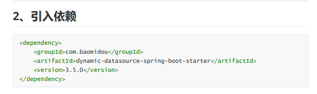

[toc]
# 一、框架结构
> 
---
# 二、代码和文档地址
> 
---
# 三、快速配置
>- ## 1.创建一个SpringBoot工程
>- ## 2.导入依赖
>>      <!--MyBatis-Plus依赖-->
>>      <dependency>
>>          <groupId>com.baomidou</groupId>
>>          <artifactId>mybatis-plus-boot-starter</artifactId>
>>          <version>3.5.1</version>
>>      </dependency>
>>      <!--Lombok依赖,使用此依赖需安装lombok插件-->
>>      <dependency>
>>          <groupId>org.projectlombok</groupId>
>>          <artifactId>lombok</artifactId>
>>          <optional>true</optional>
>>      </dependency>
>>      <!--MySQL依赖-->
>>      <dependency>
>>          <groupId>mysql</groupId>
>>          <artifactId>mysql-connector-java</artifactId>
>>          <scope>runtime</scope>
>>      </dependency>
>- ## 3.设置数据源
>> 
>> 
>- ## 4.创建实体类
>> 
>- ## 5.创建mapper接口继承BaseMapper类
>> 
>- ## 6.在主程序类上添加注解@MapperScan(""),填写扫描的mapper接口的包名
>> 
>- ## 7.创建测试类并用注解@SpringTest标注
>- ## 8.测试
>> 
>>- ### 想解决爆红，可以将对应的mapper接口作为组件加入IOC容器
>- ## 9.加入日志功能
>> 
---
# 四、BaseMapper
>- ## 功能
>>- ### 添加
>>>- #### insert()
>>>> 
>>- ### 删除
>>>- #### deleteByMap()
>>>- #### deleteBatchIds() 根据id批量删除
>>>> 
>>- ### 修改
>>>- #### updateById() 根据ID修改
>>>> 
>>- ### 查询
>>>- #### selectById() 根据ID查询
>>>> 
>>>- #### selectBatchIds() 根据id批量查询
>>>> 
>>>- #### selectByMap() 根据map查询
>>>> 
>>>- #### selectList() 使用条件构造器查询出一个List集合
>>>> 
---
# 五、自定义功能
>- ## 1.在类路径下创建mapper映射文件(要与对应的Mapper接口名字一致)
>- ## 2.在mapper接口下编写抽象方法
>- ## 3.在映射文件编写自定义SQL语句
>- ## 4.调用此接口方法 
---
# 六、通用Service接口(IService接口[CRUD接口])
>- ## 1.创建一个接口继承Iservice<实体类对象>
>- ## 2.创建一个实现类继承ServiceImpl<对应的mappe接口,对应的实体类>，并实现第1.步创建的接口
>- ## 3.对创建的实现类使用注解@Service标注，加入到IOC容器中
>- ## 4.在需要的地方自动注入即可
>- ## 5.功能
>>- ### 查询
>>> #### 总记录数count()
>>>> 
>>- ### 添加
>>> #### 批量添加saveBatch()
>>>> 
---
# 七、常用注解
>- ## @TableName(value=""):标注在实体类上，可以根据其value值去映射对应的表
>>- ## 使用MyBatisPlus的全局配置设置映射表的前缀，在实体类映射对应的表时自动加上此前缀
>>> 
>- ## @TableId:因为MyBatisPlus默认是将实体类中的id作为主键，如果作为主键的属性名不为id，则会导致报错；使用了此注解的实体类属性在表中对应的字段，会被MyBatisPlus认为是主键
>>- ### value属性：如果实体类属性名和数据库表中对应的字段名不一致，则可以将value值设置为数据库表中对应的字段名，mybatisPlus即可将其正常映射
>>- ### type属性：如果对应的字段有(自增)策略，标注此注解需要在此type值里指定(自增)策略
>>> 
>>> 
>>>- #### 使用MyBatisPlus的全局配置主键生成策略
>>>> 
>- ## @TableField:使用此注解可以设置属性映射到的字段
>> 
>- ## @TableLogic:使用此注解可以使用逻辑删除功能
>> 
>> 
>> ### 上述两步后，在实体类中创建对应的属性并用注解@TableLogic标注
>> ### 正常调用删除方法即可实现逻辑删除，查询不可查到已经逻辑删除的数据

---
# 八、雪花算法
> 
> 
> 
> 
> 
> 
> 
> 
---
# 九、条件构造器
> 
>- ## QueryWrapper
>>- ### 查询条件构造
>>> 
>>>- #### 条件构造器QueryWrapper按照排序规则查询
>>>> 
>>>- #### 条件构造器QueryWrapper只查询指定字段
>>>> 
>>>- #### 条件构造器QueryWrapper实现子查询
>>>> 
>>- ### 删除条件构造
>>> 
>>- ### 修改条件构造
>>> 
>>- ### 优先条件构造
>>> 
>- ## UpdateWrapper
>>- ### 修改条件构造
>>> 
>- ## 模拟开发中组装条件的情况
>> 
>> 
>>>- ## 使用condition组装条件
>>>> 
>- ## LambdaQueryWrapper和LambdaUpdateWrapper
>>- ### LambdaQueryWrapper
>>> 
>>- ### LambdaUpdateWrapper
>>> 
---
# 十、MyBatis自带的分页插件
>- ## 使用步骤
>>- ### 1.创建MyBatis的配置类(创建后可将主程序类的@MapperScan迁移到此类上)
>>- ### 2.配置MybatisPlusInterceptor拦截器组件，将分页插件PaginationInnerInterceptor加入到拦截器组件中
>>> 
>>- ### 3. 测试
>>> 
>- ## 自定义分页功能
>>- ### 1.在mapper接口编写Page类型的抽象方法，且第一个参数必须为Page类型
>>> 
>>- ### 2.在mapper的映射文件中书写sql语句
>>> 
>>>- #### 配置类型别名
>>>> 
>>- ### 3.调用方法
>>> 
---
# 十一、乐观锁和悲观锁
> 
>- ## 乐观锁实现流程
>> 
>>>- ### MyBatisPlus乐观锁插件的使用
>>>>- ##### 1.在实体类中的version属性上添加注解@Version
>>>>- ##### 2.创建MyBatis的配置类(创建后可将主程序类的@MapperScan迁移到此类上)
>>>>- ##### 3.配置MybatisPlusInterceptor拦截器组件，将乐观锁插件OptimisticLockerInnerInterceptor加入到拦截器组件中
>>>>> 
---
# 十二、通用枚举
>- ## 要在配置文件中开启解析枚举的配置，MyBatisPlus才会解析注解@EnumValue标注的属性
>> 
>> 
> 
> 
> 
---
# 十三、代码生成器
>- ## 使用:
>>- ### 1.引入依赖
>>>     <!--代码生成器的依赖-->
>>>     <dependency>
>>>         <groupId>com.baomidou</groupId>
>>>         <artifactId>mybatis-plus-generator</artifactId>
>>>         <version>3.5.1</version>
>>>     </dependency>
>>>     <dependency>
>>>         <groupId>org.freemarker</groupId>
>>>         <artifactId>freemarker</artifactId>
>>>         <version>2.3.31</version>
>>>     </dependency>
>>- ### 2.快速生成(创建一个类执行以下代码即可)
>>>     public class FastAutoGeneratorTest {
>>>         public static void main(String[] args) {
>>>             FastAutoGenerator.create("jdbc:mysql://127.0.0.1:3306/mybatis_plus?characterEncoding=utf-8&userSSL=false", "root", "123456")
>>>                 .globalConfig(builder -> {
>>>                     builder
>>>                         .author("atguigu") // 设置作者
>>>                         //.enableSwagger() // 开启 swagger 模式
>>>                         .fileOverride() // 覆盖已生成文件
>>>                         .outputDir("D://mybatis_plus"); // 指定输出目录
>>>                 })
>>>                 .packageConfig(builder -> {
>>>                     builder
>>>                         .parent("com.atguigu") // 设置父包名
>>>                         .moduleName("mybatisplus") // 设置父包模块名
>>>                         .pathInfo(Collections.singletonMap(OutputFile.mapperXml, "D://mybatis_plus"));
>>>                 // 设置mapperXml生成路径
>>>                 })
>>>                 .strategyConfig(builder -> {
>>>                     builder
>>>                         .addInclude("t_user") // 设置需要生成的表名
>>>                         .addTablePrefix("t_", "c_"); // 设置过滤表前缀
>>>                 })
>>>                 .templateEngine(new FreemarkerTemplateEngine()) // 使用Freemarker引擎模板，默认的是Velocity引擎模板
>>>                 .execute();
>>>         }
>>>     }
---
# 十四、多数据源
> 
> 
> 
> 
> 
> 
---
# 十五、MyBatisX插件
>- ## 1. 安装MyBatisX插件
>- ## 2. 使用MyBatisX插件
>>- ### 快速生成代码 
>>>- #### 在idea里连接到数据库
>>>- #### 找到对应的表，右键点击MybatisX-Generator
>>>- #### 输入工程绝对路径名，基础包名路径，实体类包名
>>>- #### 输入忽略的表名、字段的前后缀
>>>- #### 选择注解版本、模板、组件生成位置
>>- ### 快速生成CRUD代码
>>> 
>>>- #### 点击过后Alt+Enter
>>> 
