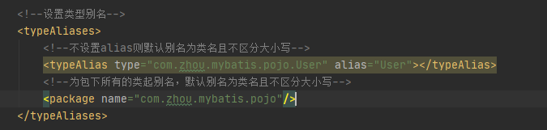
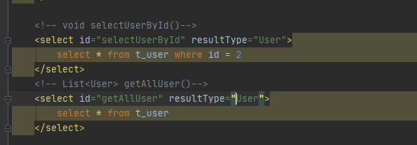
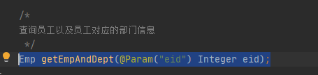
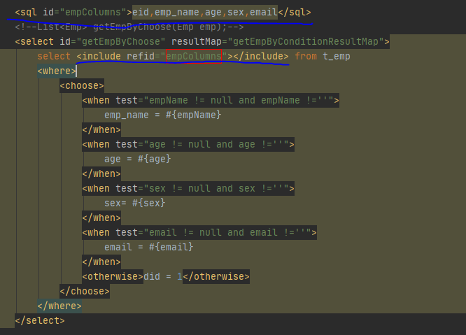
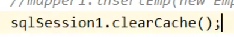
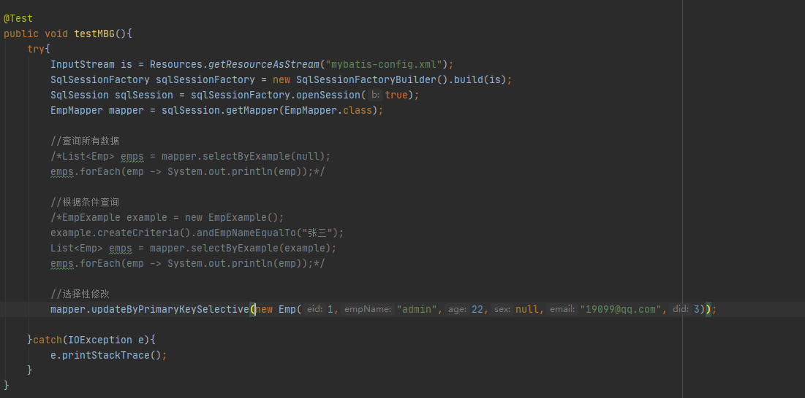

#一、简介

#二、和其他持久层技术对比

#三、快速搭建mybatis
>(一)创建maven工程

>(二)导入依赖

    <dependencies>
        <!--mybatis核心依赖-->
        <dependency>
            <groupId>org.mybatis</groupId>
            <artifactId>mybatis</artifactId>
            <version>3.5.7</version>
        </dependency>
        <!--Junit测试依赖-->
        <dependency>
            <groupId>junit</groupId>
            <artifactId>junit</artifactId>
            <version>4.12</version>
            <scope>test</scope>
        </dependency>
        <!--mysql驱动-->
        <dependency>
            <groupId>mysql</groupId>
            <artifactId>mysql-connector-java</artifactId>
            <version>8.0.30</version>
        </dependency>
    </dependencies>
  
>(三)编写java代码
>>1.创建实体类

>
>>2.创建Mapper接口
>>>规则：    
>>>- 1.表名+Mapper
>>>- 2.接口名需要与映射文件中的mapper标签中的namespace属性值一致
>>>- 3.方法名需要与sql语句标签中的id值一致
>>>
>>>

>(四)创建配置文件
>>1.核心配置文件(xml文件)
>>- 注意：mybatis核心配置文件中的标签先后顺序

	
    <?xml version="1.0" encoding="UTF-8" ?>
    <!DOCTYPE configuration
            PUBLIC "-//mybatis.org//DTD Config 3.0//EN"
            "http://mybatis.org/dtd/mybatis-3-config.dtd">
    <configuration>
        <!--配置读取properties文件-->
        <properties resource="mysql.properties"/>
        
        <environments default="development">
            <!--配置连接数据库的环境-->
            <environment id="development">
                <transactionManager type="JDBC"/>
                <dataSource type="POOLED">
                    <property name="driver" value="${driver}"/>
                    <property name="url" value="${url}"/>
                    <property name="username" value="${username}"/>
                    <property name="password" value="${password}"/>
                </dataSource>
            </environment>
        </environments>
        
        <!--引入映射文件-->
        <mappers>
            <mapper resource="mappers/UserMapper.xml"/>
        </mappers>
    </configuration>
    
>>2.映射文件
>>>(1)命名规则

>>>>编写sql语句
>>>>>- 注意:编写查询语句时，select标签内需要声明：
>>>>>   - resultType属性:设置默认的映射关系(实体类的类型)
>>>>>   - resultMap:设置自定义的映射关系(字段名和实体类属性名不一致或者在一对多和多对一的关系的情况下使用)

    <?xml version="1.0" encoding="UTF-8" ?>
    <!DOCTYPE mapper
            PUBLIC "-//mybatis.org//DTD Mapper 3.0//EN"
            "http://mybatis.org/dtd/mybatis-3-mapper.dtd">
    <mapper namespace="org.mybatis.example.BlogMapper">
        <select id="selectBlog" resultType="Blog">
            select * from Blog where id = #{id}
        </select>
    </mapper>

>(五)加入日志功能
>>1.导入依赖
    
    <!--log4j日志依赖-->
    <dependency>
        <groupId>log4j</groupId>
        <artifactId>log4j</artifactId>
        <version>1.2.17</version>
    </dependency>
    
>>2.创建log4j.xml配置文件(文件名字固定，不可更改)

    <?xml version="1.0" encoding="UTF-8" ?>
    <!DOCTYPE log4j:configuration SYSTEM "log4j.dtd">
    <log4j:configuration xmlns:log4j="http://jakarta.apache.org/log4j/">
        <appender name="STDOUT" class="org.apache.log4j.ConsoleAppender">
            <param name="Encoding" value="UTF-8" />
            <layout class="org.apache.log4j.PatternLayout">
                <param name="ConversionPattern" value="%-5p %d{MM-dd HH:mm:ss,SSS} %m (%F:%L) \n" />
            </layout>
        </appender>
        <logger name="java.sql">
            <level value="debug" />
        </logger>
        <logger name="org.apache.ibatis">
            <level value="info" />
        </logger>
        <root>
            <level value="debug" />
            <appender-ref ref="STDOUT" />
        </root>
    </log4j:configuration>
>>3.日志级别
>>>

>(六)创建测试类
>>

#四、核心配置文件详解
>environments
>>

>properties
>>

>typeAliases(类型别名标签)
>>- 注意：因为配置在mybatis核心配置文件中
>>所以需要注意mybatis核心配置文件中的标签先后顺序
>>>- 
>>>- 
>>>- 

>mappers
>>- 
>>- 
>>- 

#五、MyBatis获取参数的两种方式
>(一)两种方式
>- 1.${}：本质是字符串拼接，拼接sql语句时需要手动在sql语句里给${}加上单引号，即'${}'

>- 2.#{}：本质占位符赋值

>(二)获取参数的不同情况
>>- 1.单个字面量类型的参数：
>>>两种方式皆可使用
>>>- 
>>>- 
>>>- 
>>- 2.多个字面量类型的参数：
>>>- 两种方式皆可使用；按照方法参数的顺序，使用arg0、agr1获取参数(或者param1、param2)
>>>>- 
>>>>- 
>>>>- 
>>>>-  方法参数为多个时，mybatis底层会把参数放在一个map集合中，以两种方式存储：
>>>>>- 第一种以arg0、arg1为键，实参为值
>>>>>- 第二种以param1、param2为键，实参为值
>>- 3.map集合类型的参数(手动将参数放在map集合中，并手动设置键值)
>>>- 
>>>- 
>>>- 
>>- 4.mapper接口方法的参数是实体类类型的参数(sql语句中的键为属性名)
>>>- 
>>>- 
>>>- 
>>- 5.使用@Param注解命名参数
>>>- 
>>>- 
>>>- 
>>>- 使用@Param注解命名参数时，mybatis底层会把参数放在一个map集合中，以两种方式存储：
>>>>- 第一种以@Param注解的value值为键，实参为值
>>>>- 第二种以param1、param2为键，实参为值

#六、MyBatis中的各种查询功能
>- (一)查询一个实体类对象(只能接收一条数据，接收多条数据会抛异常TooManyResultsException)
>- (二)查询一个list集合(可以接收一条数据，也可接收多条数据)
>>- 
>>- 
>>- 
>- (三)查询一个包装类型/基本数据类型/字符串类型
>>- 
>>- 
>>- 
>>- 包装类型、一些集合、基本数据类型、Object类型在MyBatis中的默认有别名
>>>- 
>>>- 
>- (四)查询map集合
>>- 查询一个map集合
>>>- 
>>>- 
>>>- 
>>- 查询多个map集合(map集合只能接收一条数据，接收多条数据会抛异常TooManyResultsException)
>>>- 可以将map集合作为泛型放到List集合中，即可查询多条数据
>>>>- 
>>>>- 
>>>>- 
>>>- 也可以使用注解@MapKey(value="")将数据中唯一的字段作为键，查询出来的一条map数据作为值，存入到一个更大的map集合中，即可查询多条数据
>>>>- 
>>>>- 
>>>>- 

#七、特殊SQL的执行
>- (一)模糊查询
>>- 使用#{}赋值为模糊查询的sql语句中的参数赋值
>>>- 1.将%模糊查询符号使用双引号包裹
>>>> 
>>>- 2.使用concat关键字拼接
>>>> 
>>- 使用${}拼接则不需要双引号和cancat关键字拼接
>- (二)批量删除
>>- 不能使用#{}实现批量删除，因为此方式会自动为参数加上单引号
>>- 只能使用${}实现批量删除
>>>- 
>>>- 
>>>- 
>- (三)动态设置SQL语句中的表名
>>- 不能使用#{}实现批量删除，因为此方式会自动为表名加上单引号
>>- 只能使用${}实现动态设置SQL语句中的表名
>>>- 
>>>- 
>>>- 
>- (四)获取添加操作后自增的主键的值
>>>- 
>>>- 
>>>- 

#八、自定义映射resultMap(resultMap处理字段和属性的映射关系)
>- 若字段名和实体类中的属性名不一致，
>>- (一)可以在MyBatis的核心配置文件中设置setting全局配置，设置下划线_命名规则自动映射为驼峰命名规则
>>>- 
>>>- 
>>>- 
>>>- 
>>- (二)或者在SQL语句中设置字段别名
>>>- 
>>- (三)可以通过resultMap设置自定义映射
>>>- 
>>>- 
>>>- 
>- 多对一映射
>>- (一)通过级联赋值解决多对一的映射
>>>- 
>>>- 
>>>- 
>>- 通过设置association标签处理多对一关系
>>>- 
>>>- 
>>>- 
>>- 通过分步查询处理多对一关系
>>>- 注意：分步查询的好处为实现了延迟加载,但是延迟加载需要在核心配置文件里设置setting标签设置全局配置
>>>>- 
>>>- 分步查询的两个方法分别声明在对应的两个接口中，sql语句分别声明在对应的两个mapper.xml文件中
>>>- 
>>>- 
>>>- 
>>>- 
>>>- 
>- 一对多映射
>>- 通过设置collection标签处理多对一关系
>>>- 
>>>- 
>>>- 
>>>- 

#九、动态SQL
>- (一)if标签
>>- 
>>- 
>>- 
>- (二)where标签(动态生成where标签，并且自动删除拼接内容中多余的关键字[不能删除内容后的关键字，只能删除内容前的关键字])
>>- 
>>- 
>>- 
>- (三)trim标签
>>- prefix:在trim标签内内容前添加指定内容
>>- suffix:在trim标签内内容后添加指定内容
>>- prefixOverrides:在trim标签内内容前去除指定内容
>>- suffixOverrides:在trim标签内内容后去除指定内容
>>>- 
>>>- 
>>>- 
>- (四)choose、when、otherwise标签(相当于if-else if-else)
>>- when至少要有一个，otherwise最多只能有一个
>>>- 
>>>- 
>>>- 
>- (五)foreach
>>- 属性
>>>- collection:设置需要循环的集合
>>>- item:表示集合或数组中的每一个数据
>>>- separator:循环体之间的分隔符
>>>- open:foreach标签中循环的所有内容的开始符号
>>>- close:foreach标签中循环的所有内容的结束符号
>>- 通过数组实现批量删除
>>>- 
>>>- 
>>>- 
>>- 通过list集合实现批量添加
>>>- 
>>>- 
>>>- 
>- (六)sql
>>- 封装经常使用的sql语句片段，在sql语句中配合include标签插入
>>>- 

#十、MyBatis的缓存
>- (一)MyBatis的一级缓存(默认开启)
>>- 
>>- 清空缓存的方法：
>>>- 
>- (二)MyBatis的二级缓存(默认关闭)
>>- 
>>- 开启二级缓存
>>>- 
>>>- 
>>- 二级缓存的相关配置(在cache标签中配置)
>>>- 
>- (三)MyBatis缓存查询的顺序
>>- 
>- (四)MyBatis整合第三方缓存EHCache
>>- 1.添加依赖
>>>-   
 
        <!--MyBatis EHCache整合包-->
        <dependency>
            <groupId>org.mybatis.caches</groupId>
                <artifactId>mybatis-ehcache</artifactId>
                <version>1.2.2</version>
        </dependency>
            
        <!--slf4j日志门面的一个具体体现-->
        <dependency>
            <groupId>ch.qos.logback</groupId>
            <artifactId>logback-classic</artifactId>
            <version>1.2.11</version>
        </dependency>
>>>- 各jar包的功能
>>>>- 
>>- 2.创建EHCache.xml文件

    <?xml version="1.0" encoding="utf-8" ?>
    <ehcache xmlns:xsi="http://www.w3.org/2001/XMLSchema-instance"
             xsi:noNamespaceSchemaLocation="../config/ehcache.xsd">
    
        <!--磁盘保存路径-->
        <diskStore path="E:\javaEE_study\mybatis\MyBatis_demo03\ehcache"/>
    
        <defaultCache
                maxElementsInMemory="1000"
                maxElementsOnDisk="10000000"
                eternal="false"
                overflowToDisk="true"
                timeToIdleSeconds="120"
                timeToLiveSeconds="120"
                diskExpiryThreadIntervalSeconds="120"
                memoryStoreEvictionPolicy="LRU">
        </defaultCache>
    </ehcache>
>>- 3.设置二级缓存的类型
>>>- 
>>- 4.加入logback日志
    
    <?xml version="1.0" encoding="utf-8" ?>
    <configuration debug="true">
    
        <!--指定日志输出的位置-->
        <appender name="STDOUT"
                  class="ch.qos.logback.core.ConsoleAppender">
            <encoder>
                <!--日志输出的格式-->
                <!--按照顺序分别是：时间、日志级别、线程名称、打印日志的类、日志主体内容、换行-->
                <pattern>[%d{HH:mm:ss.SSS}] [%-5level] [%thread] [%logger] [%msg]%n</pattern>
            </encoder>
        </appender>
    
        <!--设置全局日志级别。日志级别按顺序分别是：DEBUG/INFO/WARN/ERROR-->
        <!--指定任何一个日志级别都只打印当前级别和后面级别的日志-->
        <root level="DEBUG">
            <!--指定打印日志的appender，这里通过"STDOUT"引用了前面配置的appender-->
            <appender-ref ref="STDOUT"/>
        </root>
    
        <!--根据特殊需求指定局部日志级别-->
        <logger name="" level="DEBUG"/>
    </configuration>

#十一、MyBatis的逆向工程

>- 1.导入依赖和插件
    
    <dependencies>
            <!--mybatis核心依赖-->
            <dependency>
                <groupId>org.mybatis</groupId>
                <artifactId>mybatis</artifactId>
                <version>3.5.7</version>
            </dependency>
        </dependencies>
    
        <!--控制Maven在构建过程中的相关配置-->
        <build>
            <!--构建过程中用到的插件-->
            <plugins>
                <!--具体插件，逆向工程的操作是以构建过程中插件形式出现的-->
                <plugin>
                    <groupId>org.mybatis.generator</groupId>
                    <artifactId>mybatis-generator-maven-plugin</artifactId>
                    <version>1.3.0</version>
                    <dependencies>
    
                        <!--逆向工程的核心依赖-->
                        <dependency>
                            <groupId>org.mybatis.generator</groupId>
                            <artifactId>mybatis-generator-core</artifactId>
                            <version>1.3.2</version>
                        </dependency>
    
                        <!--数据库连接池-->
                        <dependency>
                            <groupId>c3p0</groupId>
                            <artifactId>c3p0</artifactId>
                            <version>0.9.2</version>
                        </dependency>
    
                        <!--mysql驱动-->
                        <dependency>
                            <groupId>mysql</groupId>
                            <artifactId>mysql-connector-java</artifactId>
                            <version>8.0.30</version>
                        </dependency>
                    </dependencies>
                </plugin>
            </plugins>
        </build>
>- 2.创建mybatis核心配置文件

>- 3.创建逆向工程的配置文件generatorConfig.xml(文件名称固定写法，不可更改)
    
    <?xml version="1.0" encoding="UTF-8" ?>
    <!DOCTYPE generatorConfiguration
            PUBLIC "-//mybatis.org//DTD MyBatis Generator Configuration 1.0//EN"
            "http://mybatis.org/dtd/mybatis-generator-config_1_0.dtd">
    <generatorConfiguration>
        <!--
            targetRuntime:执行生成的逆向工程版本
                MyBatis3Simple:生成基本的CRUD(清新简介版)
                MyBatis3:生成带条件的CRUD(奢华尊享版)
        -->
        <context id="DB2Tables" targetRuntime="MyBatis3Simple">
            <!--数据库的连接信息-->
            <jdbcConnection driverClass="com.mysql.cj.jdbc.Driver"
                            ConnectionURL="jdbc:mysql://localhost:3306/mybatis"
                            userId="root"
                            password="Weizijierhuo0214">
            </jdbcConnection>
            <!-- javaBean的生成策略-->
            <javaModelGenerator targetPackage="com.atguigu.mybatis.pojo" targetProject=".\src\main\java">
                <property name="enableSubPackages" value="true" />
                <property name="trimStrings" value="true" />
            </javaModelGenerator>
            <!-- SQL映射文件的生成策略 -->
            <sqlMapGenerator targetPackage="com.atguigu.mybatis.mapper"
                             targetProject=".\src\main\resources">
                <property name="enableSubPackages" value="true" />
            </sqlMapGenerator>
            <!-- Mapper接口的生成策略 -->
            <javaClientGenerator type="XMLMAPPER"
                                 targetPackage="com.atguigu.mybatis.mapper" targetProject=".\src\main\java">
                <property name="enableSubPackages" value="true" />
            </javaClientGenerator>
            <!-- 逆向分析的表 -->
            <!-- tableName设置为*号，可以对应所有表，此时不写domainObjectName -->
            <!-- domainObjectName属性指定生成出来的实体类的类名 -->
            <table tableName="t_emp" domainObjectName="Emp"/>
            <table tableName="t_dept" domainObjectName="Dept"/>
        </context>
    </generatorConfiguration>

>- 4.执行MBG插件的generator目标
>>- 
>- 5.使用
>>- 
>>- 

#十二、分页插件
>- 分页插件的使用步骤
>>- 1.添加依赖
    
    <!--分页插件的依赖-->
    <dependency>
        <groupId>com.github.pagehelper</groupId>
        <artifactId>pagehelper</artifactId>
        <version>5.2.0</version>
    </dependency>

>>- 2.配置分页插件(在MyBatis核心配置文件中配置插件)
    
    <!--配置分页插件-->
    <plugins>
        <plugin interceptor="com.github.pagehelper.PageInterceptor"></plugin>
    </plugins>

>>- 3.使用
>>>- 