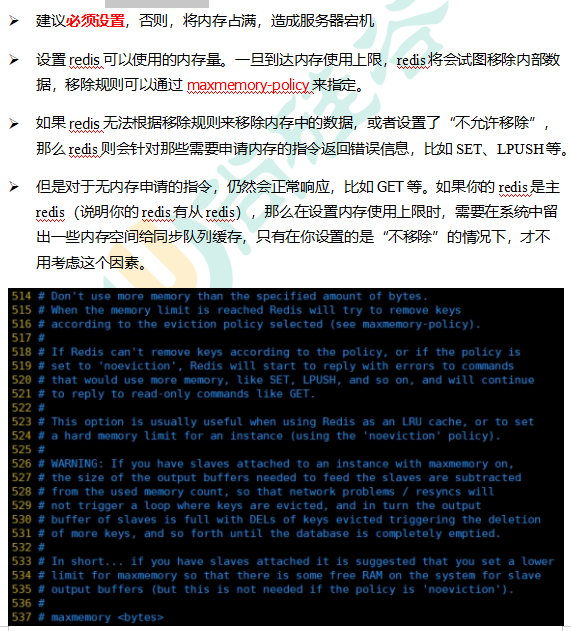
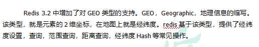

<!-- @import "[TOC]" {cmd="toc" depthFrom=1 depthTo=6 orderedList=false} -->

<!-- code_chunk_output -->

- [一、NoSQL数据库简介](#一nosql数据库简介)
- [二、Redis6的概述/安装/启动/相关知识](#二redis6的概述安装启动相关知识)
  - [概述](#概述)
  - [安装](#安装)
  - [启动](#启动)
    - [前台启动(不推荐)](#前台启动不推荐)
    - [后台启动(推荐)](#后台启动推荐)
  - [相关知识](#相关知识)
- [三、常用五大数据类型](#三常用五大数据类型)
  - [Redis 键(key)](#redis-键key)
  - [Redis 字符串(String)](#redis-字符串string)
  - [Redis 列表(List)](#redis-列表list)
  - [Redis 集合(Set)](#redis-集合set)
  - [Redis 哈希(Hash)](#redis-哈希hash)
  - [Redis有序集合Zset(sorted set)](#redis有序集合zsetsorted-set)
- [四、Redis6配置文件详解](#四redis6配置文件详解)
  - [###Units单位###](#units单位)
  - [###INCLUDES包含###](#includes包含)
  - [###网络相关配置](#网络相关配置)
    - [bind](#bind)
    - [protected-mode](#protected-mode)
    - [Port](#port)
    - [tcp-backlog](#tcp-backlog)
    - [timeout](#timeout)
    - [tcp-keepalive](#tcp-keepalive)
  - [###GENERAL通用###](#general通用)
    - [daemonize](#daemonize)
    - [pidfile](#pidfile)
    - [loglevel](#loglevel)
    - [logfile](#logfile)
    - [databases 16](#databases-16)
  - [###SECURITY安全###](#security安全)
    - [设置密码](#设置密码)
  - [#### LIMITS限制](#-limits限制)
    - [maxclients](#maxclients)
    - [maxmemory](#maxmemory)
    - [maxmemory-policy](#maxmemory-policy)
    - [maxmemory-samples](#maxmemory-samples)
- [五、Redis6的发布和订阅](#五redis6的发布和订阅)
  - [什么是发布和订阅](#什么是发布和订阅)
  - [Redis的发布和订阅](#redis的发布和订阅)
  - [发布订阅命令行实现](#发布订阅命令行实现)
- [六、Redis6新数据类型](#六redis6新数据类型)
  - [Bitmaps](#bitmaps)
    - [简介](#简介)
    - [命令](#命令)
    - [Bitmaps与set对比](#bitmaps与set对比)
  - [HyperLogLog](#hyperloglog)
    - [简介](#简介-1)
    - [命令](#命令-1)
  - [Geospatial](#geospatial)
    - [简介](#简介-2)
    - [命令](#命令-2)
- [七、Jedis操作Redis6](#七jedis操作redis6)
  - [Redis\_Jedis\_测试](#redis_jedis_测试)
    - [Jedis所需要的jar包](#jedis所需要的jar包)
    - [连接Redis注意事项](#连接redis注意事项)
    - [Jedis常用操作](#jedis常用操作)
      - [创建动态的工程](#创建动态的工程)
      - [创建测试程序](#创建测试程序)
    - [测试相关数据类型](#测试相关数据类型)
      - [Jedis-API:    Key](#jedis-api----key)
      - [Jedis-API:    String](#jedis-api----string)
      - [Jedis-API:    List](#jedis-api----list)
      - [Jedis-API:    set](#jedis-api----set)
      - [Jedis-API:    hash](#jedis-api----hash)
      - [Jedis-API:    zset](#jedis-api----zset)
  - [Redis\_Jedis\_实例](#redis_jedis_实例)
    - [完成一个手机验证码功能](#完成一个手机验证码功能)
- [八、Redis6与SpringBoot整合](#八redis6与springboot整合)
  - [整合步骤](#整合步骤)
    - [在pom.xml文件中引入redis相关依赖](#在pomxml文件中引入redis相关依赖)
    - [application.properties配置redis配置](#applicationproperties配置redis配置)
    - [添加redis配置类(高版本不需要此类，直接在Spring Initializr里勾选Redis)](#添加redis配置类高版本不需要此类直接在spring-initializr里勾选redis)
    - [测试一下](#测试一下)
- [九、Redis6的事务操作](#九redis6的事务操作)
  - [Redis\_事务\_锁机制\_秒杀](#redis_事务_锁机制_秒杀)
    - [Redis的事务定义](#redis的事务定义)
    - [Multi、Exec、discard](#multiexecdiscard)
    - [事务的错误处理](#事务的错误处理)
    - [为什么要做成事务](#为什么要做成事务)
    - [事务冲突的问题](#事务冲突的问题)
      - [例子](#例子)
      - [悲观锁](#悲观锁)
      - [乐观锁](#乐观锁)
      - [WATCH key \[key ...\]](#watch-key-key-)
      - [unwatch](#unwatch)
    - [Redis事务三特性](#redis事务三特性)
  - [Redis\_事务\_秒杀案例](#redis_事务_秒杀案例)
    - [解决计数器和人员记录的事务操作](#解决计数器和人员记录的事务操作)
    - [Redis事务--秒杀并发模拟](#redis事务--秒杀并发模拟)
    - [超卖问题](#超卖问题)
    - [利用乐观锁淘汰用户，解决超卖问题](#利用乐观锁淘汰用户解决超卖问题)
    - [继续增加并发测试](#继续增加并发测试)
    - [解决库存遗留问题](#解决库存遗留问题)
    - [Redis\_事务\_秒杀案例\_代码](#redis_事务_秒杀案例_代码)
- [十、Redis6持久化之RDB](#十redis6持久化之rdb)
  - [总体介绍](#总体介绍)
  - [RDB（Redis DataBase）](#rdbredis-database)
    - [官网介绍](#官网介绍)
    - [是什么](#是什么)
    - [备份是如何执行的](#备份是如何执行的)
    - [Fork](#fork)
    - [RDB持久化流程](#rdb持久化流程)
    - [dump.rdb文件](#dumprdb文件)
    - [配置位置](#配置位置)
    - [如何触发RDB快照；保持策略](#如何触发rdb快照保持策略)
      - [配置文件中默认的快照配置](#配置文件中默认的快照配置)
      - [命令save VS bgsave](#命令save-vs-bgsave)
      - [flushall命令](#flushall命令)
      - [###SNAPSHOTTING快照###](#snapshotting快照)
      - [Save](#save)
      - [stop-writes-on-bgsave-error](#stop-writes-on-bgsave-error)
      - [rdbcompression 压缩文件](#rdbcompression-压缩文件)
      - [rdbchecksum 检查完整性](#rdbchecksum-检查完整性)
      - [rdb的备份](#rdb的备份)
    - [优势](#优势)
    - [劣势](#劣势)
    - [如何停止](#如何停止)
    - [小总结](#小总结)
- [十一、Redis6持久化之AOF](#十一redis6持久化之aof)
  - [AOF（Append Only File）](#aofappend-only-file)
    - [是什么](#是什么-1)
    - [AOF持久化流程](#aof持久化流程)
    - [AOF默认不开启](#aof默认不开启)
    - [AOF和RDB同时开启，redis听谁的？](#aof和rdb同时开启redis听谁的)
    - [AOF启动/修复/恢复](#aof启动修复恢复)
    - [AOF同步频率设置](#aof同步频率设置)
    - [Rewrite压缩](#rewrite压缩)
    - [优势](#优势-1)
    - [劣势](#劣势-1)
    - [小总结](#小总结-1)
  - [总结(Which one)](#总结which-one)
    - [用哪个好](#用哪个好)
    - [官网建议](#官网建议)
- [十二、Redis6的主从复制](#十二redis6的主从复制)
  - [是什么](#是什么-2)
  - [能干嘛](#能干嘛)
  - [怎么玩：主从复制](#怎么玩主从复制)
    - [新建redis6379.conf，填写以下内容](#新建redis6379conf填写以下内容)
    - [新建redis6380.conf，填写以下内容](#新建redis6380conf填写以下内容)
    - [新建redis6381.conf，填写以下内容](#新建redis6381conf填写以下内容)
    - [启动三台redis服务器](#启动三台redis服务器)
    - [查看系统进程，看看三台服务器是否启动](#查看系统进程看看三台服务器是否启动)
    - [查看三台主机运行情况](#查看三台主机运行情况)
    - [配从(库)不配主(库)](#配从库不配主库)
  - [常用3招](#常用3招)
    - [一主二仆](#一主二仆)
    - [薪火相传](#薪火相传)
    - [反客为主](#反客为主)
  - [复制原理](#复制原理)
  - [哨兵模式(sentinel)](#哨兵模式sentinel)
    - [是什么](#是什么-3)
    - [怎么玩(使用步骤)](#怎么玩使用步骤)
      - [调整为一主二仆模式，6379带着6380、6381](#调整为一主二仆模式6379带着63806381)
      - [自定义的/myredis目录下新建sentinel.conf文件，名字绝不能错](#自定义的myredis目录下新建sentinelconf文件名字绝不能错)
      - [配置哨兵,填写内容](#配置哨兵填写内容)
      - [启动哨兵](#启动哨兵)
      - [当主机挂掉，从机选举中产生新的主机](#当主机挂掉从机选举中产生新的主机)
      - [复制延时](#复制延时)
    - [故障恢复](#故障恢复)
    - [主从复制](#主从复制)
- [十三、Redis6集群](#十三redis6集群)
  - [问题](#问题)
  - [什么是集群](#什么是集群)
  - [删除持久化数据](#删除持久化数据)
  - [制作6个实例，6379,6380,6381,6389,6390,6391](#制作6个实例637963806381638963906391)
    - [配置基本信息](#配置基本信息)
    - [redis cluster配置修改](#redis-cluster配置修改)
    - [修改好redis6379.conf文件，拷贝多个redis.conf文件](#修改好redis6379conf文件拷贝多个redisconf文件)
    - [使用查找替换修改另外5个文件](#使用查找替换修改另外5个文件)
    - [启动6个redis服务](#启动6个redis服务)
  - [将六个节点合成一个集群](#将六个节点合成一个集群)
  - [-c 采用集群策略连接，设置数据会自动切换到相应的写主机](#-c-采用集群策略连接设置数据会自动切换到相应的写主机)
  - [通过 cluster nodes 命令查看集群信息](#通过-cluster-nodes-命令查看集群信息)
  - [redis cluster 如何分配这六个节点?](#redis-cluster-如何分配这六个节点)
  - [什么是slots](#什么是slots)
  - [在集群中录入值](#在集群中录入值)
  - [查询集群中的值](#查询集群中的值)
  - [故障恢复](#故障恢复-1)
  - [集群的Jedis开发](#集群的jedis开发)
    - [代码](#代码)
  - [Redis 集群提供了以下好处](#redis-集群提供了以下好处)
  - [Redis 集群的不足](#redis-集群的不足)
- [十四、Redis6应用问题解决](#十四redis6应用问题解决)
  - [缓存穿透](#缓存穿透)
    - [问题描述](#问题描述)
    - [解决方案](#解决方案)
  - [缓存击穿](#缓存击穿)
    - [问题描述](#问题描述-1)
    - [解决方案](#解决方案-1)
  - [缓存雪崩](#缓存雪崩)
    - [问题描述](#问题描述-2)
    - [解决方案](#解决方案-2)
  - [分布式锁](#分布式锁)
    - [问题描述](#问题描述-3)
    - [解决方案：使用redis实现分布式锁](#解决方案使用redis实现分布式锁)
    - [编写代码](#编写代码)
      - [代码](#代码-1)
    - [优化之设置锁的过期时间](#优化之设置锁的过期时间)
    - [优化之UUID防误删](#优化之uuid防误删)
    - [优化之LUA脚本保证删除的原子性](#优化之lua脚本保证删除的原子性)
      - [Lua 脚本详解：](#lua-脚本详解)
    - [总结](#总结)
      - [1.加锁](#1加锁)
      - [2.使用lua释放锁](#2使用lua释放锁)
      - [3.重试](#3重试)
- [十五、Redis6.0新功能](#十五redis60新功能)
  - [ACL](#acl)
    - [简介](#简介-3)
    - [命令](#命令-3)
  - [IO多线程](#io多线程)
    - [简介](#简介-4)
    - [原理架构](#原理架构)
  - [工具支持 Cluster](#工具支持-cluster)
  - [Redis新功能持续关注](#redis新功能持续关注)

<!-- /code_chunk_output -->

# 一、NoSQL数据库简介
>
>
>
>
>
>
>
>
>
>
# 二、Redis6的概述/安装/启动/相关知识
## 概述
>>
>>
>>
>>
## 安装
>>
>>
>>
>>
>>
>>
>>
>>
## 启动
### 前台启动(不推荐)
>>>
### 后台启动(推荐)
>>>
>>> 注意修改的是备份出来的文件
>>>
>>>
## 相关知识
>>
>>
# 三、常用五大数据类型
>
## Redis 键(key)
>>
## Redis 字符串(String)
>>
>>
>>
>>
>>
>>
## Redis 列表(List)
>>
>>
>>
>>
## Redis 集合(Set)
>>
>>
## Redis 哈希(Hash)
>>
>>
>>
## Redis有序集合Zset(sorted set)
>>
>>
>>
>>
# 四、Redis6配置文件详解
>
## ###Units单位###
>>
## ###INCLUDES包含###
>>
## ###网络相关配置 ###
### bind
>>>
>>>
### protected-mode
>>>
>>>
### Port
>>>
### tcp-backlog
>>>
### timeout
>>>
>>>
### tcp-keepalive
>>>
## ###GENERAL通用###
### daemonize
>>>
### pidfile
>>>
>>>
### loglevel
>>>
### logfile
>>>
### databases 16
>>>
## ###SECURITY安全###
### 设置密码
>>>
## #### LIMITS限制 ###
### maxclients
>>>
>>>
### maxmemory
>>>
### maxmemory-policy
>>>
### maxmemory-samples
>>>
# 五、Redis6的发布和订阅
## 什么是发布和订阅
>>
## Redis的发布和订阅
>>
## 发布订阅命令行实现
>>
>>
# 六、Redis6新数据类型
## Bitmaps
### 简介
>>>
>>>
### 命令
>>>
>>>
>>>
>>>
### Bitmaps与set对比
>>>
>>>
## HyperLogLog
### 简介
>>>
### 命令
>>>
>>>
>>>
## Geospatial
### 简介
>>>
### 命令
>>>
>>>
>>>
# 七、Jedis操作Redis6
## Redis_Jedis_测试
### Jedis所需要的jar包
>>>      <dependency>
>>>          <groupId>redis.clients</groupId>
>>>          <artifactId>jedis</artifactId>
>>>          <version>3.2.0</version>
>>>      </dependency>
### 连接Redis注意事项
>>
### Jedis常用操作
#### 创建动态的工程
#### 创建测试程序
>>>>     import redis.clients.jedis.Jedis;
>>>>     public class Demo01 {
>>>>         public static void main(String[] args) {
>>>>             Jedis jedis = new Jedis("192.168.137.3",6379);
>>>>             String pong = jedis.ping();
>>>>             System.out.println("连接成功："+pong);
>>>>             jedis.close();
>>>>         }
>>>>     }
### 测试相关数据类型
#### Jedis-API:    Key
>>>>     jedis.set("k1", "v1");
>>>>     jedis.set("k2", "v2");
>>>>     jedis.set("k3", "v3");
>>>>     Set<String> keys = jedis.keys("*");
>>>>     System.out.println(keys.size());
>>>>     for (String key : keys) {
>>>>     System.out.println(key);
>>>>     }
>>>>     System.out.println(jedis.exists("k1"));
>>>>     System.out.println(jedis.ttl("k1"));                
>>>>     System.out.println(jedis.get("k1"));
#### Jedis-API:    String
>>>>     jedis.mset("str1","v1","str2","v2","str3","v3");
>>>>     System.out.println(jedis.mget("str1","str2","str3"));
#### Jedis-API:    List
>>>>     List<String> list = jedis.lrange("mylist",0,-1);
>>>>     for (String element : list) {
>>>>     System.out.println(element);
>>>>     }
#### Jedis-API:    set
>>>>     jedis.sadd("orders", "order01");
>>>>     jedis.sadd("orders", "order02");
>>>>     jedis.sadd("orders", "order03");
>>>>     jedis.sadd("orders", "order04");
>>>>     Set<String> smembers = jedis.smembers("orders");
>>>>     for (String order : smembers) {
>>>>     System.out.println(order);
>>>>     }
>>>>     jedis.srem("orders", "order02");
#### Jedis-API:    hash
>>>>     jedis.hset("hash1","userName","lisi");
>>>>     System.out.println(jedis.hget("hash1","userName"));
>>>>     Map<String,String> map = new HashMap<String,String>();
>>>>     map.put("telphone","13810169999");
>>>>     map.put("address","atguigu");
>>>>     map.put("email","abc@163.com");
>>>>     jedis.hmset("hash2",map);
>>>>     List<String> result = jedis.hmget("hash2", "telphone","email");
>>>>     for (String element : result) {
>>>>     System.out.println(element);
>>>>     }
#### Jedis-API:    zset
>>>>     jedis.zadd("zset01", 100d, "z3");
>>>>     jedis.zadd("zset01", 90d, "l4");
>>>>     jedis.zadd("zset01", 80d, "w5");
>>>>     jedis.zadd("zset01", 70d, "z6");
>>>>     Set<String> zrange = jedis.zrange("zset01", 0, -1);
>>>>     for (String e : zrange) {
>>>>     System.out.println(e);
>>>>     }
## Redis_Jedis_实例
### 完成一个手机验证码功能
>>>
>>>
# 八、Redis6与SpringBoot整合
## 整合步骤
### 在pom.xml文件中引入redis相关依赖
>>>     <!-- redis -->
>>>     <dependency>
>>>         <groupId>org.springframework.boot</groupId>
>>>         <artifactId>spring-boot-starter-data-redis</artifactId>
>>>     </dependency>
>>>     <!-- spring2.X集成redis所需common-pool2-->
>>>     <dependency>
>>>         <groupId>org.apache.commons</groupId>
>>>         <artifactId>commons-pool2</artifactId>
>>>         <version>2.6.0</version>
>>>     </dependency>
### application.properties配置redis配置
>>>     #Redis服务器地址
>>>     spring.redis.host=192.168.140.136
>>>     #Redis服务器连接端口
>>>     spring.redis.port=6379
>>>     #Redis数据库索引（默认为0）
>>>     spring.redis.database= 0
>>>     #连接超时时间（毫秒）
>>>     spring.redis.timeout=1800000
>>>     #连接池最大连接数（使用负值表示没有限制）
>>>     spring.redis.lettuce.pool.max-active=20
>>>     #最大阻塞等待时间(负数表示没限制)
>>>     spring.redis.lettuce.pool.max-wait=-1
>>>     #连接池中的最大空闲连接
>>>     spring.redis.lettuce.pool.max-idle=5
>>>     #连接池中的最小空闲连接
>>>     spring.redis.lettuce.pool.min-idle=0
### 添加redis配置类(高版本不需要此类，直接在Spring Initializr里勾选Redis)
>>>     @EnableCaching
>>>     @Configuration
>>>     public class RedisConfig extends CachingConfigurerSupport {
>>>     
>>>         @Bean
>>>         public RedisTemplate<String, Object> redisTemplate(RedisConnectionFactory factory) {
>>>             RedisTemplate<String, Object> template = new RedisTemplate<>();
>>>             RedisSerializer<String> redisSerializer = new StringRedisSerializer();
>>>             Jackson2JsonRedisSerializer jackson2JsonRedisSerializer = new Jackson2JsonRedisSerializer(Object.class);
>>>             ObjectMapper om = new ObjectMapper();
>>>             om.setVisibility(PropertyAccessor.ALL, JsonAutoDetect.Visibility.ANY);
>>>             om.enableDefaultTyping(ObjectMapper.DefaultTyping.NON_FINAL);
>>>             jackson2JsonRedisSerializer.setObjectMapper(om);
>>>             template.setConnectionFactory(factory);
>>>             //key序列化方式
>>>             template.setKeySerializer(redisSerializer);
>>>             //value序列化
>>>             template.setValueSerializer(jackson2JsonRedisSerializer);
>>>             //value hashmap序列化
>>>             template.setHashValueSerializer(jackson2JsonRedisSerializer);
>>>             return template;
>>>         }
>>>     
>>>         @Bean
>>>         public CacheManager cacheManager(RedisConnectionFactory factory) {
>>>             RedisSerializer<String> redisSerializer = new StringRedisSerializer();
>>>             Jackson2JsonRedisSerializer jackson2JsonRedisSerializer = new Jackson2JsonRedisSerializer(Object.class);
>>>             //解决查询缓存转换异常的问题
>>>             ObjectMapper om = new ObjectMapper();
>>>             om.setVisibility(PropertyAccessor.ALL, JsonAutoDetect.Visibility.ANY);
>>>             om.enableDefaultTyping(ObjectMapper.DefaultTyping.NON_FINAL);
>>>             jackson2JsonRedisSerializer.setObjectMapper(om);
>>>             // 配置序列化（解决乱码的问题）,过期时间600秒
>>>             RedisCacheConfiguration config = RedisCacheConfiguration.defaultCacheConfig()
>>>                     .entryTtl(Duration.ofSeconds(600))
>>>                     .serializeKeysWith(RedisSerializationContext.SerializationPair.fromSerializer(redisSerializer))
>>>                     .serializeValuesWith(RedisSerializationContext.SerializationPair.fromSerializer(jackson2JsonRedisSerializer))
>>>                     .disableCachingNullValues();
>>>             RedisCacheManager cacheManager = RedisCacheManager.builder(factory)
>>>                     .cacheDefaults(config)
>>>                     .build();
>>>             return cacheManager;
>>>         }
>>>     }
### 测试一下
>>>     @RestController
>>>     @RequestMapping("/redisTest")
>>>     public class RedisTestController {
>>>         @Autowired
>>>         private RedisTemplate redisTemplate;
>>>     
>>>         @GetMapping
>>>         public String testRedis() {
>>>             //设置值到redis
>>>             redisTemplate.opsForValue().set("name","lucy");
>>>             //从redis获取值
>>>             String name = (String)redisTemplate.opsForValue().get("name");
>>>             return name;
>>>         }
>>>     }
# 九、Redis6的事务操作
## Redis_事务_锁机制_秒杀
### Redis的事务定义
>>>
### Multi、Exec、discard
>>>
>>>
### 事务的错误处理
>>>
>>>
### 为什么要做成事务
>>>
### 事务冲突的问题
#### 例子
>>>>
#### 悲观锁
>>>>
#### 乐观锁
>>>>
#### WATCH key [key ...]
>>>>
>>>>
#### unwatch
>>>>
### Redis事务三特性
>>>
## Redis_事务_秒杀案例
### 解决计数器和人员记录的事务操作
>>>
### Redis事务--秒杀并发模拟
>>>
>>>
>>>
>>>
### 超卖问题
>>>
### 利用乐观锁淘汰用户，解决超卖问题
>>>
>>>
### 继续增加并发测试
>>>
>>>
>>>
### 解决库存遗留问题
>>>
>>>
### Redis_事务_秒杀案例_代码
>>>
>>>
# 十、Redis6持久化之RDB
## 总体介绍
>>
>>
## RDB（Redis DataBase）
### 官网介绍
>>>
### 是什么
>>>
### 备份是如何执行的
>>>
### Fork
>>>
### RDB持久化流程
>>>
### dump.rdb文件
>>>
>>>
### 配置位置
>>>
### 如何触发RDB快照；保持策略
#### 配置文件中默认的快照配置
>>>>
#### 命令save VS bgsave
>>>>
#### flushall命令
>>>>
#### ###SNAPSHOTTING快照###
#### Save
>>>>
#### stop-writes-on-bgsave-error
>>>>
#### rdbcompression 压缩文件
>>>>
#### rdbchecksum 检查完整性
>>>>
#### rdb的备份
>>>>
### 优势
>>>
>>>
### 劣势
>>>
### 如何停止
>>>
### 小总结
>>>
# 十一、Redis6持久化之AOF
## AOF（Append Only File）
### 是什么
>>>
### AOF持久化流程
>>>
>>>
### AOF默认不开启
>>>
### AOF和RDB同时开启，redis听谁的？
>>>
### AOF启动/修复/恢复
>>>
>>>
### AOF同步频率设置
>>>
### Rewrite压缩
>>>
>>>
>>>
### 优势
>>>
### 劣势
>>>
### 小总结
>>>
## 总结(Which one)
### 用哪个好
>>>
### 官网建议
>>>
>>>
# 十二、Redis6的主从复制
## 是什么
>>>
## 能干嘛
>>>
## 怎么玩：主从复制
>>>
### 新建redis6379.conf，填写以下内容
>>>
### 新建redis6380.conf，填写以下内容
>>>
### 新建redis6381.conf，填写以下内容
>>>
>>>
### 启动三台redis服务器
>>>
### 查看系统进程，看看三台服务器是否启动
>>>
### 查看三台主机运行情况
>>>
### 配从(库)不配主(库)
>>>
>>>
## 常用3招
### 一主二仆
>>>
>>>
### 薪火相传
>>>
### 反客为主
>>>
>>>
## 复制原理
>>
## 哨兵模式(sentinel)
### 是什么
>>>
>>>
### 怎么玩(使用步骤)
#### 调整为一主二仆模式，6379带着6380、6381
>>>>
#### 自定义的/myredis目录下新建sentinel.conf文件，名字绝不能错
#### 配置哨兵,填写内容
>>>>
#### 启动哨兵
>>>>
>>>>
#### 当主机挂掉，从机选举中产生新的主机
>>>>
>>>>
#### 复制延时
>>>>
### 故障恢复
>>>
### 主从复制
>>>     private static JedisSentinelPool jedisSentinelPool=null;
>>>     
>>>     public static  Jedis getJedisFromSentinel(){
>>>     if(jedisSentinelPool==null){
>>>                 Set<String> sentinelSet=new HashSet<>();
>>>                 sentinelSet.add("192.168.11.103:26379");
>>>     
>>>                 JedisPoolConfig jedisPoolConfig =new JedisPoolConfig();
>>>                 jedisPoolConfig.setMaxTotal(10); //最大可用连接数
>>>                 jedisPoolConfig.setMaxIdle(5); //最大闲置连接数
>>>                 jedisPoolConfig.setMinIdle(5); //最小闲置连接数
>>>                 jedisPoolConfig.setBlockWhenExhausted(true); //连接耗尽是否等待
>>>                 jedisPoolConfig.setMaxWaitMillis(2000); //等待时间
>>>                 jedisPoolConfig.setTestOnBorrow(true); //取连接的时候进行一下测试 ping pong
>>>                 jedisSentinelPool=new JedisSentinelPool("mymaster",sentinelSet,jedisPoolConfig);
>>>                 return jedisSentinelPool.getResource();
>>>             }else{
>>>                 return jedisSentinelPool.getResource();
>>>             }
>>>     }
# 十三、Redis6集群
## 问题
>>
## 什么是集群
>>
## 删除持久化数据
>>
## 制作6个实例，6379,6380,6381,6389,6390,6391
### 配置基本信息
>>>
>>>
### redis cluster配置修改
>>>
### 修改好redis6379.conf文件，拷贝多个redis.conf文件
>>>
### 使用查找替换修改另外5个文件 
>>>
### 启动6个redis服务
>>>
## 将六个节点合成一个集群
>>
>>
>>
## -c 采用集群策略连接，设置数据会自动切换到相应的写主机
>>
## 通过 cluster nodes 命令查看集群信息
>>
## redis cluster 如何分配这六个节点?
>>
## 什么是slots
>>
## 在集群中录入值
>>
>>
## 查询集群中的值
>>
## 故障恢复
>>
## 集群的Jedis开发
>>
### 代码
>>>      public class JedisClusterTest {
>>>        public static void main(String[] args) { 
>>>           Set<HostAndPort>set =new HashSet<HostAndPort>();
>>>           set.add(new HostAndPort("192.168.31.211",6379));
>>>           JedisCluster jedisCluster=new JedisCluster(set);
>>>           jedisCluster.set("k1", "v1");
>>>           System.out.println(jedisCluster.get("k1"));
>>>        }
>>>      }
## Redis 集群提供了以下好处
>>
## Redis 集群的不足
>>
# 十四、Redis6应用问题解决
## 缓存穿透
### 问题描述
>>>
### 解决方案
>>>
>>>
## 缓存击穿
### 问题描述
>>>
### 解决方案
>>>
>>>
## 缓存雪崩
### 问题描述
>>>
>>>
### 解决方案
>>>
>>>
## 分布式锁
### 问题描述
>>>
### 解决方案：使用redis实现分布式锁
>>>
>>>
### 编写代码
>>>
#### 代码
>>>>        @GetMapping("testLock")
>>>>        public void testLock(){
>>>>            //1获取锁，setne
>>>>            Boolean lock = redisTemplate.opsForValue().setIfAbsent("lock", "111");
>>>>            //2获取锁成功、查询num的值
>>>>            if(lock){
>>>>                Object value = redisTemplate.opsForValue().get("num");
>>>>                //2.1判断num为空return
>>>>                if(StringUtils.isEmpty(value)){
>>>>                    return;
>>>>                }
>>>>                //2.2有值就转成成int
>>>>                int num = Integer.parseInt(value+"");
>>>>                //2.3把redis的num加1
>>>>                redisTemplate.opsForValue().set("num", ++num);
>>>>                //2.4释放锁，del
>>>>                redisTemplate.delete("lock");
>>>>        
>>>>            }else{
>>>>                //3获取锁失败、每隔0.1秒再获取
>>>>                try {
>>>>                    Thread.sleep(100);
>>>>                    testLock();
>>>>                } catch (InterruptedException e) {
>>>>                    e.printStackTrace();
>>>>                }
>>>>            }
>>>>        }
>>>
>>>
### 优化之设置锁的过期时间
>>>
>>>
### 优化之UUID防误删
>>>
>>>
### 优化之LUA脚本保证删除的原子性
>>>     @GetMapping("testLockLua")
>>>     public void testLockLua() {
>>>         //1 声明一个uuid ,将做为一个value 放入我们的key所对应的值中
>>>         String uuid = UUID.randomUUID().toString();
>>>         //2 定义一个锁：lua 脚本可以使用同一把锁，来实现删除！
>>>         String skuId = "25"; // 访问skuId 为25号的商品 100008348542
>>>         String locKey = "lock:" + skuId; // 锁住的是每个商品的数据
>>>     
>>>         // 3 获取锁
>>>         Boolean lock = redisTemplate.opsForValue().setIfAbsent(locKey, uuid, 3, TimeUnit.SECONDS);
>>>     
>>>         // 第一种： lock 与过期时间中间不写任何的代码。
>>>         // redisTemplate.expire("lock",10, TimeUnit.SECONDS);//设置过期时间
>>>         // 如果true
>>>         if (lock) {
>>>             // 执行的业务逻辑开始
>>>             // 获取缓存中的num 数据
>>>             Object value = redisTemplate.opsForValue().get("num");
>>>             // 如果是空直接返回
>>>             if (StringUtils.isEmpty(value)) {
>>>                 return;
>>>             }
>>>             // 不是空 如果说在这出现了异常！ 那么delete 就删除失败！ 也就是说锁永远存在！
>>>             int num = Integer.parseInt(value + "");
>>>             // 使num 每次+1 放入缓存
>>>             redisTemplate.opsForValue().set("num", String.valueOf(++num));
>>>             /*使用lua脚本来锁*/
>>>             // 定义lua 脚本
>>>             String script = "if redis.call('get', KEYS[1]) == ARGV[1] then return redis.call('del', KEYS[1]) else return 0 end";
>>>             // 使用redis执行lua执行
>>>             DefaultRedisScript<Long> redisScript = new DefaultRedisScript<>();
>>>             redisScript.setScriptText(script);
>>>             // 设置一下返回值类型 为Long
>>>             // 因为删除判断的时候，返回的0,给其封装为数据类型。如果不封装那么默认返回String 类型，
>>>             // 那么返回字符串与0 会有发生错误。
>>>             redisScript.setResultType(Long.class);
>>>             // 第一个要是script 脚本 ，第二个需要判断的key，第三个就是key所对应的值。
>>>             redisTemplate.execute(redisScript, Arrays.asList(locKey), uuid);
>>>         } else {
>>>             // 其他线程等待
>>>             try {
>>>                 // 睡眠
>>>                 Thread.sleep(1000);
>>>                 // 睡醒了之后，调用方法。
>>>                 testLockLua();
>>>             } catch (InterruptedException e) {
>>>                 e.printStackTrace();
>>>             }
>>>         }
>>>     }
#### Lua 脚本详解：
>>>>
>>>>
>>>>
### 总结
#### 1.加锁
>>>>        // 1. 从redis中获取锁,set k1 v1 px 20000 nx
>>>>        String uuid = UUID.randomUUID().toString();
>>>>        Boolean lock = this.redisTemplate.opsForValue()
>>>>              .setIfAbsent("lock", uuid, 2, TimeUnit.SECONDS);
#### 2.使用lua释放锁
>>>>        // 2. 释放锁 del
>>>>        String script = "if redis.call('get', KEYS[1]) == ARGV[1] then return redis.call('del', KEYS[1]) else return 0 >>>>     end";
>>>>        // 设置lua脚本返回的数据类型
>>>>        DefaultRedisScript<Long> redisScript = new DefaultRedisScript<>();
>>>>        // 设置lua脚本返回类型为Long
>>>>        redisScript.setResultType(Long.class);
>>>>        redisScript.setScriptText(script);
>>>>        redisTemplate.execute(redisScript, Arrays.asList("lock"),uuid);
#### 3.重试
>>>>        Thread.sleep(500);
>>>>        testLock();
>>>>
# 十五、Redis6.0新功能
## ACL
### 简介
>>>
>>>
### 命令
>>>
>>>
>>>
## IO多线程
### 简介
>>>
### 原理架构
>>>
## 工具支持 Cluster
>>
>>
## Redis新功能持续关注
>>