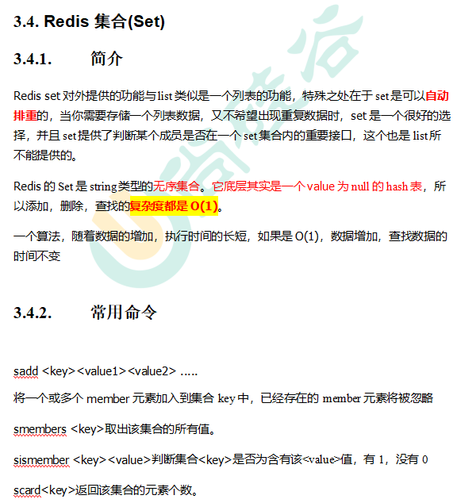
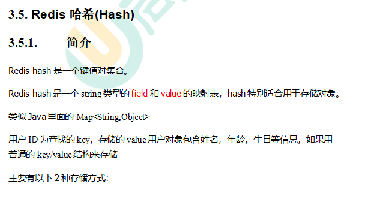

[toc]

# 一、NoSQL数据库简介
>
>
>
>
>
>
>
>
>
>
# 二、Redis6的概述/安装/启动/相关知识
## 概述
>>
>>
>>
>>
## 安装
>>
>>
>>
>>
>>
>>
>>
>>
## 启动
### 前台启动(不推荐)
>>>
### 后台启动(推荐)
>>>
>>> 注意修改的是备份出来的文件
>>>
>>>
## 相关知识
>>
>>
# 三、常用五大数据类型
>
## Redis 键(key)
>>
## Redis 字符串(String)
>>
>>
>>
>>
>>
>>
## Redis 列表(List)
>>
>>
>>
>>
## Redis 集合(Set)
>>
>>
## Redis 哈希(Hash)
>>
>>
>>
## Redis有序集合Zset(sorted set)
>>
>>
>>
>>
# 四、Redis6配置文件详解
>
## ###Units单位###
>>
## ###INCLUDES包含###
>>
## ###网络相关配置 ###
### bind
>>>
>>>
### protected-mode
>>>
>>>
### Port
>>>
### tcp-backlog
>>>
### timeout
>>>
>>>
### tcp-keepalive
>>>
## ###GENERAL通用###
### daemonize
>>>
### pidfile
>>>
>>>
### loglevel
>>>
### logfile
>>>
### databases 16
>>>
## ###SECURITY安全###
### 设置密码
>>>
## #### LIMITS限制 ###
### maxclients
>>>
>>>
### maxmemory
>>>
### maxmemory-policy
>>>
### maxmemory-samples
>>>
# 五、Redis6的发布和订阅
# 六、Redis6新数据类型
# 七、Jedis操作Redis6
# 八、Redis6与SpringBoot整合
# 九、Redis6的事务操作
# 十、Redis6持久化之RDB
# 十一、Redis6持久化之AOF
# 十二、Redis6的主从复制
# 十三、Redis6集群
# 十四、Redis6应用问题解决