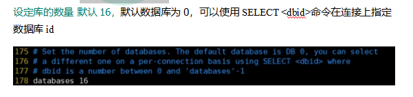

[toc]

# 一、NoSQL数据库简介
>
>
>
>
>
>
>
>
>
>
# 二、Redis6的概述/安装/启动/相关知识
## 概述
>>
>>
>>
>>
## 安装
>>
>>
>>
>>
>>
>>
>>
>>
## 启动
### 前台启动(不推荐)
>>>
### 后台启动(推荐)
>>>
>>> 注意修改的是备份出来的文件
>>>
>>>
## 相关知识
>>
>>
# 三、常用五大数据类型
>
## Redis 键(key)
>>
## Redis 字符串(String)
>>
>>
>>
>>
>>
>>
## Redis 列表(List)
>>
>>
>>
>>
## Redis 集合(Set)
>>
>>
## Redis 哈希(Hash)
>>
>>
>>
## Redis有序集合Zset(sorted set)
>>
>>
>>
>>
# 四、Redis6配置文件详解
>
## ###Units单位###
>>
## ###INCLUDES包含###
>>
## ###网络相关配置 ###
### bind
>>>
>>>
### protected-mode
>>>
>>>
### Port
>>>
### tcp-backlog
>>>
### timeout
>>>
>>>
### tcp-keepalive
>>>
## ###GENERAL通用###
### daemonize
>>>
### pidfile
>>>
>>>
### loglevel
>>>
### logfile
>>>
### databases 16
>>>
## ###SECURITY安全###
### 设置密码
>>>
## #### LIMITS限制 ###
### maxclients
>>>
>>>
### maxmemory
>>>
### maxmemory-policy
>>>
### maxmemory-samples
>>>
# 五、Redis6的发布和订阅
## 什么是发布和订阅
>>
## Redis的发布和订阅
>>
## 发布订阅命令行实现
>>
>>
# 六、Redis6新数据类型
## Bitmaps
### 简介
>>>
>>>
### 命令
>>>
>>>
>>>
>>>
### Bitmaps与set对比
>>>
>>>
## HyperLogLog
### 简介
>>>
### 命令
>>>
>>>
>>>
## Geospatial
### 简介
>>>
### 命令
>>>
>>>
>>>
# 七、Jedis操作Redis6
## Redis_Jedis_测试
### Jedis所需要的jar包
>>>      <dependency>
>>>          <groupId>redis.clients</groupId>
>>>          <artifactId>jedis</artifactId>
>>>          <version>3.2.0</version>
>>>      </dependency>
### 连接Redis注意事项
>>
### Jedis常用操作
#### 创建动态的工程
#### 创建测试程序
>>>>     import redis.clients.jedis.Jedis;
>>>>     public class Demo01 {
>>>>         public static void main(String[] args) {
>>>>             Jedis jedis = new Jedis("192.168.137.3",6379);
>>>>             String pong = jedis.ping();
>>>>             System.out.println("连接成功："+pong);
>>>>             jedis.close();
>>>>         }
>>>>     }
### 测试相关数据类型
#### Jedis-API:    Key
>>>>     jedis.set("k1", "v1");
>>>>     jedis.set("k2", "v2");
>>>>     jedis.set("k3", "v3");
>>>>     Set<String> keys = jedis.keys("*");
>>>>     System.out.println(keys.size());
>>>>     for (String key : keys) {
>>>>     System.out.println(key);
>>>>     }
>>>>     System.out.println(jedis.exists("k1"));
>>>>     System.out.println(jedis.ttl("k1"));                
>>>>     System.out.println(jedis.get("k1"));
#### Jedis-API:    String
>>>>     jedis.mset("str1","v1","str2","v2","str3","v3");
>>>>     System.out.println(jedis.mget("str1","str2","str3"));
#### Jedis-API:    List
>>>>     List<String> list = jedis.lrange("mylist",0,-1);
>>>>     for (String element : list) {
>>>>     System.out.println(element);
>>>>     }
#### Jedis-API:    set
>>>>     jedis.sadd("orders", "order01");
>>>>     jedis.sadd("orders", "order02");
>>>>     jedis.sadd("orders", "order03");
>>>>     jedis.sadd("orders", "order04");
>>>>     Set<String> smembers = jedis.smembers("orders");
>>>>     for (String order : smembers) {
>>>>     System.out.println(order);
>>>>     }
>>>>     jedis.srem("orders", "order02");
#### Jedis-API:    hash
>>>>     jedis.hset("hash1","userName","lisi");
>>>>     System.out.println(jedis.hget("hash1","userName"));
>>>>     Map<String,String> map = new HashMap<String,String>();
>>>>     map.put("telphone","13810169999");
>>>>     map.put("address","atguigu");
>>>>     map.put("email","abc@163.com");
>>>>     jedis.hmset("hash2",map);
>>>>     List<String> result = jedis.hmget("hash2", "telphone","email");
>>>>     for (String element : result) {
>>>>     System.out.println(element);
>>>>     }
#### Jedis-API:    zset
>>>>     jedis.zadd("zset01", 100d, "z3");
>>>>     jedis.zadd("zset01", 90d, "l4");
>>>>     jedis.zadd("zset01", 80d, "w5");
>>>>     jedis.zadd("zset01", 70d, "z6");
>>>>     Set<String> zrange = jedis.zrange("zset01", 0, -1);
>>>>     for (String e : zrange) {
>>>>     System.out.println(e);
>>>>     }
## Redis_Jedis_实例
### 完成一个手机验证码功能
>>>
>>>
# 八、Redis6与SpringBoot整合
## 整合步骤
### 在pom.xml文件中引入redis相关依赖
>>>     <!-- redis -->
>>>     <dependency>
>>>         <groupId>org.springframework.boot</groupId>
>>>         <artifactId>spring-boot-starter-data-redis</artifactId>
>>>     </dependency>
>>>     <!-- spring2.X集成redis所需common-pool2-->
>>>     <dependency>
>>>         <groupId>org.apache.commons</groupId>
>>>         <artifactId>commons-pool2</artifactId>
>>>         <version>2.6.0</version>
>>>     </dependency>
### application.properties配置redis配置
>>>     #Redis服务器地址
>>>     spring.redis.host=192.168.140.136
>>>     #Redis服务器连接端口
>>>     spring.redis.port=6379
>>>     #Redis数据库索引（默认为0）
>>>     spring.redis.database= 0
>>>     #连接超时时间（毫秒）
>>>     spring.redis.timeout=1800000
>>>     #连接池最大连接数（使用负值表示没有限制）
>>>     spring.redis.lettuce.pool.max-active=20
>>>     #最大阻塞等待时间(负数表示没限制)
>>>     spring.redis.lettuce.pool.max-wait=-1
>>>     #连接池中的最大空闲连接
>>>     spring.redis.lettuce.pool.max-idle=5
>>>     #连接池中的最小空闲连接
>>>     spring.redis.lettuce.pool.min-idle=0
### 添加redis配置类(高版本不需要此类，直接在Spring Initializr里勾选Redis)
>>>     @EnableCaching
>>>     @Configuration
>>>     public class RedisConfig extends CachingConfigurerSupport {
>>>     
>>>         @Bean
>>>         public RedisTemplate<String, Object> redisTemplate(RedisConnectionFactory factory) {
>>>             RedisTemplate<String, Object> template = new RedisTemplate<>();
>>>             RedisSerializer<String> redisSerializer = new StringRedisSerializer();
>>>             Jackson2JsonRedisSerializer jackson2JsonRedisSerializer = new Jackson2JsonRedisSerializer(Object.class);
>>>             ObjectMapper om = new ObjectMapper();
>>>             om.setVisibility(PropertyAccessor.ALL, JsonAutoDetect.Visibility.ANY);
>>>             om.enableDefaultTyping(ObjectMapper.DefaultTyping.NON_FINAL);
>>>             jackson2JsonRedisSerializer.setObjectMapper(om);
>>>             template.setConnectionFactory(factory);
>>>             //key序列化方式
>>>             template.setKeySerializer(redisSerializer);
>>>             //value序列化
>>>             template.setValueSerializer(jackson2JsonRedisSerializer);
>>>             //value hashmap序列化
>>>             template.setHashValueSerializer(jackson2JsonRedisSerializer);
>>>             return template;
>>>         }
>>>     
>>>         @Bean
>>>         public CacheManager cacheManager(RedisConnectionFactory factory) {
>>>             RedisSerializer<String> redisSerializer = new StringRedisSerializer();
>>>             Jackson2JsonRedisSerializer jackson2JsonRedisSerializer = new Jackson2JsonRedisSerializer(Object.class);
>>>             //解决查询缓存转换异常的问题
>>>             ObjectMapper om = new ObjectMapper();
>>>             om.setVisibility(PropertyAccessor.ALL, JsonAutoDetect.Visibility.ANY);
>>>             om.enableDefaultTyping(ObjectMapper.DefaultTyping.NON_FINAL);
>>>             jackson2JsonRedisSerializer.setObjectMapper(om);
>>>             // 配置序列化（解决乱码的问题）,过期时间600秒
>>>             RedisCacheConfiguration config = RedisCacheConfiguration.defaultCacheConfig()
>>>                     .entryTtl(Duration.ofSeconds(600))
>>>                     .serializeKeysWith(RedisSerializationContext.SerializationPair.fromSerializer(redisSerializer))
>>>                     .serializeValuesWith(RedisSerializationContext.SerializationPair.fromSerializer(jackson2JsonRedisSerializer))
>>>                     .disableCachingNullValues();
>>>             RedisCacheManager cacheManager = RedisCacheManager.builder(factory)
>>>                     .cacheDefaults(config)
>>>                     .build();
>>>             return cacheManager;
>>>         }
>>>     }
### 测试一下
>>>     @RestController
>>>     @RequestMapping("/redisTest")
>>>     public class RedisTestController {
>>>         @Autowired
>>>         private RedisTemplate redisTemplate;
>>>     
>>>         @GetMapping
>>>         public String testRedis() {
>>>             //设置值到redis
>>>             redisTemplate.opsForValue().set("name","lucy");
>>>             //从redis获取值
>>>             String name = (String)redisTemplate.opsForValue().get("name");
>>>             return name;
>>>         }
>>>     }
# 九、Redis6的事务操作
## Redis_事务_锁机制_秒杀
### Redis的事务定义
>>>
### Multi、Exec、discard
>>>
>>>
### 事务的错误处理
>>>
>>>
### 为什么要做成事务
>>>
### 事务冲突的问题
#### 例子
>>>>
#### 悲观锁
>>>>
#### 乐观锁
>>>>
#### WATCH key [key ...]
>>>>
>>>>
#### unwatch
>>>>
### Redis事务三特性
>>>
## Redis_事务_秒杀案例
### 解决计数器和人员记录的事务操作
>>>
### Redis事务--秒杀并发模拟
>>>
>>>
>>>
>>>
### 超卖问题
>>>
### 利用乐观锁淘汰用户，解决超卖问题
>>>
>>>
### 继续增加并发测试
>>>
>>>
>>>
### 解决库存遗留问题
>>>
>>>
### Redis_事务_秒杀案例_代码
>>>
>>>
# 十、Redis6持久化之RDB))
# 十一、Redis6持久化之AOF
# 十二、Redis6的主从复制
# 十三、Redis6集群
# 十四、Redis6应用问题解决