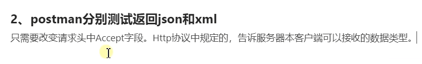

#一、介绍
>- ##Spring Boot是一个高层框架，底层为Spring Framework
>>- 
>>- 
>>- ###优点和缺点
>>>- 
>>- ###Spring Boot的时代背景
>>>- 
>>>- ####分布式 
>>>>- 
>>>>- 
>>>- ####云原生
>>>>- 
>>>>- 

#二、Spring Boot基础入门
>- 
>- ##设置maven，修改maven的配置(maven根目录config文件夹下settings.xml)
>>     <mirrors>
>>         <mirror>
>>             <id>nexus-aliyun</id>
>>             <mirrorOf>central</mirrorOf>
>>             <name>Nexus-aliyun</name>
>>             <url>http://maven.aliyun.com/nexus/content/groups.public</url>
>>         </mirror>
>>     </mirrors>
>>     <profiles>
>>         <profile>
>>             <id>jdk-1.8</id>
>>             <activation>
>>                 <activeByDefault>true</activeByDefault>
>>                 <jdk>1.8</jdk>
>>             </activation>
>>             <properties>
>>                 <maven.compiler.source>1.8</maven.compiler.source>
>>                 <maven.compiler.target>1.8</maven.compiler.target>
>>                 <maven.compiler.compilerVersion>1.8</maven.compiler.compilerVersion>
>>             </properties>
>>         </profile>
>>     </profiles>
>- ##创建maven工程
>- ##引入依赖    
>>     <parent>
>>        <groupId>org.springframework.boot</groupId>
>>        <artifactId>spring-boot-starter-parent</artifactId>
>>        <version>2.3.4.RELEASE</version>
>>     </parent>
>>     <!--导入web场景-->
>>     <dependencies>
>>         <dependency>
>>             <groupId>org.springframework.boot</groupId>
>>             <artifactId>spring-boot-starter-web</artifactId>
>>         </dependency>
>>     </dependencies>
>- ##创建主程序类
>>- 
>>- ###使用@SpringBootApplication注解
>>- ###创建main方法,设置启动run方法:
>>>-     SpringApplication.run(主程序类名.class);
>- ##编写业务并启动主程序类
>>- 
>- ##测试
>- ##简化配置
>>- ###properties文件方式：资源文件夹下创建application.properties(文件名固定写法)
>>>- ####修改服务器端口号
>>>>     server.port=
>- ##简化部署
>>- ###把项目打成jar包，直接运行，无需部署到tomcat中(SpringBoot集成了Servlet容器)
>>>- ####导入插件
>>>>     <!--导入插件，直接把项目打包成jar包-->
>>>>     <build>
>>>>         <plugins>
>>>>             <plugin>
>>>>                 <groupId>org.springframework.boot</groupId>
>>>>                 <artifactId>spring-boot-maven-plugin</artifactId>
>>>>                 <version>2.7.2</version>
>>>>             </plugin>
>>>>         </plugins>
>>>>     </build>
>>>- ####点击maven生命周期中package(打包)功能直接打包
>>>- ####进入到target打包出来的文件夹，启动命令行，输入一下命令可以直接运行项目:
>>>>     java -jar jar包名.jar
>>>>- #####注意点：需要在cmd属性里取消快速编辑模式，否则鼠标点击命令行内容会导致项目无法启动成功
>- ##了解自动配置原理
>>- ###SpringBoot特点
>>>- ####1.依赖管理特性
>>>>     <parent>
>>>>        <groupId>org.springframework.boot</groupId>
>>>>        <artifactId>spring-boot-starter-parent</artifactId>
>>>>        <version>2.3.4.RELEASE</version>
>>>>     </parent>
>>>>- #####spring-boot-starter-parent的父项目
>>>>>       <parent>
>>>>>         <groupId>org.springframework.boot</groupId>
>>>>>         <artifactId>spring-boot-dependencies</artifactId>
>>>>>        <version>2.3.4.RELEASE</version>
>>>>>       </parent>
>>>>>- ######spring-boot-dependencies集成了很多依赖，几乎声明了所有开发中常用的jar的依赖的版本号，spring-boot-starter-parent继承了此项目，所以默认导入了这些依赖，且自动进行了版本管理，所以我们只需让项目继承spring-boot-starter-parent，即导入了依赖
>>>>>>- 
>>>>>- ######在当前项目里重写配置(修改版本)
>>>>>>- 
>>>>- #####spring-boot-starter-*:*代表某种场景，只要引入starter，这个场景所有常规需要的依赖就自动引入了
>>>>>- ######SpringBoot的starter所有支持的场景：https://docs.spring.io/spring-boot/docs/current/reference/html/using-spring-boot.html#using-boot-starter
>>>>>- ######见到的名字格式为：*-spring-boot-starter，一般是第三方提供的简化开发的场景启动器
>>>>>- ######所有场景启动器最底层的依赖
>>>>>>       <dependency>
>>>>>>           <groupId>org.springframework.boot</groupId>
>>>>>>           <artifactId>spring-boot-starter</artifactId>
>>>>>>           <version>2.3.4.RELEASE</version>
>>>>>>           <scope>compile</scope>
>>>>>>       </dependency>
>>>>- #####引入依赖默认都可以不写版本号；引入非版本仲裁的jar，需要写版本号
>>>- ####2.自动配置特性
>>>>- #####自动配好Tomcat
>>>>>- ######引入Tomcat依赖
>>>>>>      <dependency>
>>>>>>          <groupId>org.springframework.boot</groupId>
>>>>>>          <artifactId>spring-boot-starter-tomcat</artifactId>
>>>>>>          <version>2.3.4.RELEASE</version>
>>>>>>          <scope>compile</scope>
>>>>>>      </dependency> 
>>>>>- ######配置Tomcat
>>>>- #####自动配好SpringMVC
>>>>>- ######引入SpringMVC全部组件依赖
>>>>>>      <dependency>
>>>>>>          <groupId>org.springframework</groupId>
>>>>>>          <artifactId>spring-web</artifactId>
>>>>>>          <version>5.2.9.RELEASE</version>
>>>>>>          <scope>compile</scope>
>>>>>>      </dependency>
>>>>>>      <dependency>
>>>>>>          <groupId>org.springframework</groupId>
>>>>>>          <artifactId>spring-webmvc</artifactId>
>>>>>>          <version>5.2.9.RELEASE</version>
>>>>>>          <scope>compile</scope>
>>>>>>      </dependency>  
>>>>>- ######配置SpringMVC常用组件(功能)
>>>>- #####自动配好Web常见功能：比如编码过滤器
>>>>>- ######SpringBoot自动配好了所有web开发的常见场景
>>>>- #####默认的包结构
>>>>>- ######SpringBoot主程序所在的包及其子包所有的组件(注解标注)都能被默认扫描到，无需设置包扫描，如果需要扫描主程序包外的组件，则需给主程序类上的注解@SpringBootApplication写上scanBasePackages="包名"属性
>>>>>>     @SpringBootApplication(scanBasePackages="包名")
>>>>- #####各种配置拥有默认值
>>>>>- ######默认配置最终都是映射到MultipartProperties类上
>>>>>- ######配置文件的值最终都会绑定到某个类上，这个类会在容器中创建对象
>>>>- #####按需加载所有自动配置项
>>>>>- ######引入对应starter场景，对应的场景才会开启自动配置
>>>>>- ######SpringBoot所有自动配置功能都在spring-boot-autoconfigure包里
>>>>>>      <dependency>
>>>>>>          <groupId>org.springframework。boot</groupId>
>>>>>>          <artifactId>spring-boot-autoconfigure</artifactId>
>>>>>>          <version>2.3.4.RELEASE</version>
>>>>>>          <scope>compile</scope>
>>>>>>      </dependency> 
>>- ###容器功能
>>>- ####组件的添加
>>>>- #####@Configuration
>>>>>- ######属性：proxyBeanMethods:代理bean的方法，如果等于true，则在主程序类获取的配置类的实例实际上是被代理类增强了的代理对象，调用组件方法获取的实例为单实例；如果是false则获取的是配置类本身的实例，调用组件方法获取的实例不是单实例
>>>>>- ######在主程序类的包下或子包下创建配置类并用注解@Configuration标注此类
>>>>>>- 
>>>>>>- 在主程序类中获取组件
>>>>>>>- 
>>>>>>>- 配置类本身也是一个组件，也可以在主程序类获取到，如果获取配置类实例后调用组件方法，获取到的仍然是容器中的单实例实例(前提：proxyBeanMethods=true；proxyBeanMethods:@Configuration注解的属性，是代理bean的方法，如果等于true，则在主程序类获取的配置类的实例实际上是被代理类增强了的代理对象，调用组件方法获取的实例为单实例；如果是false则获取的是配置类本身的实例，调用组件方法获取的实例不是单实例)
>>>>- #####@Bean、@Component、@Controller、@Service、@Repository
>>>>>- ######@Bean
>>>>>>- 在配置类中编写方法并用@Bean标注此方法(给容器添加组件，以方法名作为组件的id。返回类型就是组件类型，返回的值就是在容器中的实例)，即可把组件添加到容器中(默认为单实例)
>>>>>>>- 
>>>>- #####@ComponentScan、@Import
>>>>>- ######@Import
>>>>>>- 
>>>>- #####@Conditional(条件装配)
>>>>>- ######@ConditionalOnBean(检测容器中是否存在指定的bean组件，不存在则标注的组件方法不生效(标注配置类则类中的所有组件方法不生效))
>>>>>>- 
>>>- ####原生配置文件引入
>>>>- #####@ImportResource：使用次注解导入外部资源(配置文件)
>>>>>- 
>>>>- #####@Component+@ConfigurationProperties
>>>>>- 
>>>>>- 
>>>>- #####@EnableConfigurationProperties(开启属性配置功能，使用了注解@ConfigurationProperties的类可以不使用注解加入容器中，SpringBoot会根据添加的class自动扫描加入)
>>>>>- 
>>- ###自动配置原理入门
>>>- ####引导加载自动配置类@SpringBootApplication
>>>>- #####(1)@SpringBootConfiguration
>>>>>- ######@Configuration:代表当前类是一个配置类
>>>>- #####(2)EnableAutoConfiguration
>>>>>- ######@AutoConfigurationPackage
>>>>>>- @Import(AutoConfigurationPackages.Registrar.class):利用Registrar往容器中导入一系列组件，将指定的一个包下(主程序类所处于的包)的所有组件导入进来
>>>>>- ######@Import(AutoConfigurationImportSelector.class)
>>>>>>- 利用getAutoConfigurationEntry(annotationMetadata)给容器导入一些组件
>>>>>>- 调用List<String> configurations = getCandidateConfigurations(annotationMetadata, attributes)获取所有需要导入到容器中的配置类
>>>>>>- 利用工厂记载 Map<String,List<String>> loadSpringFactories(@Nullable ClassLoader classloader)得到所有组件
>>>>>>- 从META-INF/spring.factories位置加载一个文件，默认扫描当前系统内所有META-INF/spring.factories位置的文件(spring-boot-autoconfigure.jar包里面有META-INF/spring.factories，意味着spring-boot一启动就要给容器中加载所有的配置类)
>>>>- #####(3)ConponentScan:包扫描
>>>- ####按需开启自动配置项
>>>>- #####虽然127个场景的所有自动配置启动的时候默认全部加载，但是有条件装配规则，最终会按需配置
>>>- ####定制化修改自动配置
>>>>- #####SpringBoot底层会自动配置组件，如果用户自己配了，则以用户配的优先。
>>>>- #####底层绑定的配置默认都是绑定配置文件指定的值
>>>>- #####需要修改底层的默认配置，则
>>>>>- ######@Bean注解添加组件到IOC容器
>>>>>- ######修改配置文件
>>>- ####最佳实践
>>>>- #####引入场景依赖
>>>>- #####查看自动配置了哪些
>>>>>- ######在配置文件里填写debug=true，启动SpringBoot即可查看,Negative(生效)/Positive(不生效)
>>>>- #####是否需要定制化(修改)
>>>>>- ######参照文档修改配置
>>>>>- ######自定义加入或者替代组件
>>>>- #####Lombok的使用
>>>>>- ######导入依赖
>>>>>>      <!--Lombok依赖-->
>>>>>>      <dependency>
>>>>>>          <groupId>org.projectlombok</groupId>
>>>>>>          <artifactId>lombok</artifactId>
>>>>>>      </dependency>
>>>>>- ######安装idea的lombok插件并重启idea
>>>>>- ######使用注解标记JavaBean类
>>>>>>- @Data:自动生成get和set方法
>>>>>>- @ToString:自动生成toString方法
>>>>>>- 构造器方法注解:
>>>>>>>- @AllArgsConstructor:全部属性的有参构造器
>>>>>>>- @NoArgsConstructor:无参构造器
>>>>>>- @Slf4j:日志
>>>>- #####热更新(实质是重新启动)
>>>>>- ######导入依赖
>>>>>>      <!--热更新-->
>>>>>>      <dependency>
>>>>>>          <groupId>org.springframework.boot</groupId>
>>>>>>          <artifactId>spring-boot-devtools</artifactId>
>>>>>>          <optional>true</optional>           
>>>>>>      </dependency>
>>>>>- ######Ctrl+F9启动重新编译
>>>>- #####Spring Initializr(idea快速创建SpringBoot项目)

#三、Spring Boot核心功能
>- 
>- ##配置文件
>>- ###properties文件
>>- ###yaml文件
>>>- ####简介：
>>>> 
>>>- ####语法：
>>>> 
>>>- ####语法：
>>>> 
>- ##web开发
>>- ###SpringMVC自动配置概览
>>- ###简单功能分析
>>>- ####静态资源访问
>>>>- #####静态资源目录
>>>>>- ######类路径下: called/static(or/public or/resources or/META-INF/resources)，在这些结构目录下都可以访问到静态资源
>>>>>>- 在配置文件中填写spring.mvc.static-path-pattern=/resources/**，请求路径即改变为'当前项目+static-path-pattern+静态资源名'(静态资源文件夹下找)
>>>>>>- 在配置文件中填写resources.static-locations=[classpath:/文件夹名/]，即静态资源只会在此文件夹下寻找
>>>>>>- 访问:当前项目根路径+静态资源名(请求会先经过控制层Controller寻找有没有能处理此请求的控制器方法，如果没有则访问静态资源，如果没有此资源，则404)
>>>>- #####webjar
>>>>>- ######导入依赖
>>>>>       <!--webjar-->
>>>>>       <dependency>
>>>>>           <groupId>org.webjars</groupId>
>>>>>           <artifactId>jquery</artifactId>
>>>>>           <version>3.5.1</version>
>>>>>       </dependency>
>>>>- #####访问地址:项目名/webjars/文件夹/资源 
>>>- ####欢迎页支持和favicon
>>>>- #####欢迎页默认index.html
>>>>>- ######可以配置静态资源路径resources.static-locations
>>>>- #####favicon小图标
>>>>>- 将favicon.ico放在静态资源目录下，浏览器选项卡的小图标即被替换为此图片
>>>- ####静态资源配置原理
>>>>- #####SpringBoot启动默认加载xxxAutoConfiguration(自动配置类)
>>>>- #####SpringMVC功能的自动配置类WebMvcAutoConfiguration
>>>>>- ######WebMvcAutoConfigurationAdapter
>>>>- #####resources:
>>>>>- ######add-mappings:false 禁用所有静态资源规则
>>>>>- ######cache:
>>>>>>- Period:11000 静态资源缓存11000秒
>>- ###请求参数处理
>>>- ####请求映射
>>>>- #####RESTFul风格:需要在配置文件中开启HiddenHttpMethodFilter过滤器：mvc.hiddenmethod.filter.enabled:true
>>>>>- ######额外兼容PUT/DELETE/PATCH方式的请求
>>>>- ##### 请求映射原理
>>>>> 
>>>>>
>>>>> 
>>>>> 
>>>>> 
>>>- ####普通参数与基本注解
>>>> 
>>>>- #####@RequestAttribute
>>>>> 
>>>>- #####矩阵变量
>>>>> 
>>>>>- ######使用注解@MatrixVariable获取矩阵变量
>>>>>>- 因为SpringBoot自动移除url路径请求分号(;)后的内容，所以需要关闭移除功能，有两种方式：
>>>>>>>- 1.配置类实现WebMvcConfigurer接口，重写configurePathMatch方法
>>>>>>>- 2.往IOC容器添加WebMvcConfigurer组件，也是重写configurePathMatch方法
>>>>>>- 使用注解@MatrixVariable获取矩阵变量 
>>>>>>>- 当多个矩阵变量的key值相同时，获取的写法
>>>- ####POJO封装过程
>>>- ####参数处理原理
>>>>- 各种类型参数解析原理
>>>>>- ######注解：
>>>>>>
>>>>>- Servlet API：
>>>>>>
>>>>>- ######复杂参数：
>>>>>>
>>>>>- ######自定义对象参数：
>>>>>>
>>>>>- ######自定义Converter
>>>>>>
>>>>>>- #####两种方式
>>>>>>>- 1.配置类实现WebMvcConfigurer接口，重写addFormatters方法
>>>>>>>- 2.往IOC容器添加WebMvcConfigurer组件，也是重写addFormatters方法 
>>- ###数据响应与内容协商
>>>- ####响应JSON
>>>>- #####jackson.jar+@ResponseBody
>>>>>- ######SpringBoot的web场景已经自动引入了json依赖 
>>>>>- ######使用注解@ResponseBody标注控制器方法，访问此控制器时即可返回json数据
>>>>>>
>>>>- HTTPMessageConverter
>>>- ####内容协商(根据客户端的接收能力不同，返回不同媒体类型的数据)
>>>>- #####引入XML依赖
>>>>>       <!--XML依赖-->
>>>>>       <dependency>
>>>>>           <groupId>com.fasterxml.jackson.dataformat</groupId>
>>>>>           <artifactId>jackson-dataformat-xml</artifactId>             
>>>>>       </dependency>             
>>>> 
>>>> 
>>>> 
>>>- ####自定义MessageConverter 
>>>> 
>>>>
>>>> 
>>>>
>>>> 
>>>>- #####两种方式
>>>>>- 1.配置类实现WebMvcConfigurer接口，重写extendMessageConverters方法(拓展更多自定义MessageConverter),或者configureMessageConverters(覆盖原生的MessageConverter)
>>>>>- 2.往IOC容器添加WebMvcConfigurer组件，也是重写extendMessageConverters方法或configureMessageConverters方法 
>>- ###视图解析与模板引擎
>>- ###拦截器
>>- ###跨域
>>- ###异常处理
>>- ###原生Servlet组件
>>- ###嵌入式Web容器
>>- ###定制化原理
>- ##数据访问
>- ##单元测试
>- ##指标监控
>- ##原理解析

#四、Spring Boot场景整合
>- 
