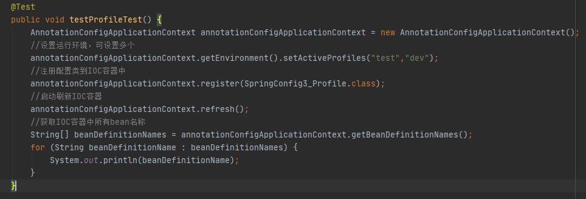
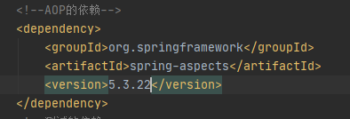

#一、Spring注解驱动开发概述

#二、快速使用
##(一)创建Maven工程导入依赖
	<dependencies>
		<!--spring的依赖-->
        <dependency>
            <groupId>org.springframework</groupId>
            <artifactId>spring-context</artifactId>
            <version>5.3.22</version>
        </dependency>
		<!--测试的依赖-->
		<dependency>
            <groupId>junit</groupId>
            <artifactId>junit</artifactId>
            <version>4.12</version>
            <scope>test</scope>
        </dependency>
    </dependencies>
##(二)创建config类

###1.为此类添加@Configuration注解

###2.创建一个方法，返回类型为想要注册的类，并为此方法添加@Bean注解，即可将注册的类的实例交给IOC容器管理，名字默认为方法名，也可通过@Bean的value值指定名字

###3.在需要获取实例的方法获取IOC容器，并取出实例

###4.开启包扫描，扫描指定位置：在配置类上添加注解@ComponentScan（""），将指定包内标有注解@Repository、@Controller、@Service、@Component的类、以及自身这个配置类交给到IOC容器管理

#二、各类注解详解

##(一)配置类的注解

###1.@Configuration

###2.@ComponentScan
####(1)value:用于指定包扫描的位置，数组类型属性(可指明多个位置进行扫描)

####(2)excludeFilters:用于排除不需要扫描的位置，数组类型属性(可指明多个位置排除扫描),数组类型属性(可指明多个内容)
#####可使用注解@Filter指定排除：

######[1] type：用于指定排除的规则(按照类型排除)
	{1}FilterType.ANNOTATION：按照注解类型
	{2}FilterType.ASSIGNABLE_TYPE：按照类的类型，包括其子类和实现类
	{3}FilterType.REGEX：按照正则表达式
	{4}FilterType.CUSTOM：使用自定义规则

######[2] classes：用于指定排除的具体内容,数组类型属性(可指明多个内容)

####(3)includeFilters:用于扫描只需要扫描的位置，数组类型属性(可指明多个位置进行扫描),数组类型属性(可指明多个内容)，需要先关闭默认的扫描规则
######[1] type：用于指定排除的规则(按照类型扫描)
	{1}FilterType.ANNOTATION：按照注解类型
	{2}FilterType.ASSIGNABLE_TYPE：按照类的类型，包括其子类和实现类
	{3}FilterType.REGEX：按照正则表达式
	{4}FilterType.CUSTOM：使用自定义规则，可以创建一个类实现TypeFilter接口，指定具体的过滤规则
>FilterType.CUSTOM的使用:
>>
>>
>>
######[2] classes：用于指定扫描的具体内容,数组类型属性(可指明多个内容)

####(4)useDefaultFilters:默认为true，表示开启默认扫描规则，修改为false则表示关闭默认的扫描规则

###4.@Conditional:按照一定条件进行判断，满足条件在IOC容器中注册Bean

###5.@Import：直接将指定的类注入到IOC容器，默认名字为全类名
####1.属性：value：class类型数组吗，用于指定注入的类
####2.使用：
	[1]直接填写想注入的类的class

	
	[2]创建一个类实现ImportSelect接口，重写selectImports(AnnotationMetadata importingClassMetadata)方法，并将此类的class写入到配置类的@Import注解的value属性里去

	[3]创建一个类实现ImportBeanDefinitonRegistrar接口，重写registerBeanDefinitions(AnnotationMetadata importingClassMetadata, BeanDefinitionRegistry registry)方法，并将此类的class写入到配置类的@Import注解的value属性里去

##(二)配置类里方法的注解
	
###1.@bean:在容器中注册一个Bean，类型为返回值的类型，默认使用方法名作为名字
	使用value指定bean名称，如不使用则默认bean名称为方法名
	注入时使用属性init-method和destroy-method指定初始化和销毁方法

###2.@Scope：指定IOC创建此实例是多例还是单例
####(1)value：
	prototype:多实例，IOC容器启动不会调用方法创建对象放到IOC容器中，每次获取实例都是直接调用方法获取实例
	singleton:单实例(默认值),IOC容器启动会调用方法创建对象放到IOC容器中，以后每次获取就是直接从容器中获取(map.get())；可以使用懒加载，使得容器启动的时候不创建对象，等到需要使用再调用方法进行创建，并放到IOC容器中
	request:同一个请求创建一个实例
	session:同一个session创建一个实例

###3.@Lazy:实现Bean的注册的懒加载，在单例模式中，使得容器启动的时候不创建对象，等到需要使用再调用方法进行创建，并放到IOC容器中

###4.@Conditional:按照一定条件进行判断，满足条件在IOC容器中注册Bean，数组类型属性(可指明多个内容)
####(1)属性：value:class类型数组，数组类型属性(可指明多个内容)
####(2)使用
	创建一个类实现Condition接口，重写其方法matches(ConditionContext context, AnnotatedTypeMetadata metadata)

	为方法或类标注上注解@Conditional

##(三)MVC架构的类注入到IOC容器的注解
###1.@Service
###2.@Controller
###3.@Repository
###4.@Component

##(四)实体类pojo的注解
###1.@Value：给实体类的属性赋值	
####赋值的类型：
	[1]基本数据类型

	[2]spEL:#{}

	[3]环境变量里的值:${}
		{1}创建外部文件或者直接将key-value数据加载到环境变量中

		{2}需要先将外部文件加载到环境变量中(使用@Property标注在配置类上）

		{3}使用@value("${}")

##(五)自动装配
###1.@Autowired：
####(1)属性：
	required
		[1]true：默认值，如果没有找到bean就报错
		[2]false:设置成此值，找不到bean不报错

####(2)使用：
	[1]默认优先按照类型在IOC容器中寻找组件装配
	[2]如果存在多个同类型的组件，则按照属性名称去寻找组件

	[3]也可使用另一注解@Qualifier指定名称去IOC容器中寻找组件

	[4]也可以标注在方法上

	
	[5]也可以标注在构造器上

	
	[6]如果组件已经注入IOC容器，且此组件只有一个有参构造器，则此构造器可以省略注解@Autowired，参数还是可以自动去IOC容器中获取

	[7]在配置类中注入组件，如果注入的方法有参数，也可省略@Autowired,参数也会自动去IOC容器中获取(@Bean+方法参数)

###2.@Qualifier：配合Autowired使用，用于指定在IOC容器中寻找的名称条件
###3.@Primary：配合Autowired使用；没有使用@Qualifier注解时，在配置类里注入bean的方法上标注此注解，则在IOC多个同类型的组件中，自动装配时优先使用此注入的bean
###4.@Resource(java规范的注解)：和@Autowired(Spring规范的注解)一样实现自动装配
	但默认按照组件名称进行装配
	不支持@Primary注解
	不支持required属性
####(1)属性值：
name：设置了name值后按照name值装配
###5.@Inject(java规范的注解)：和@Autowired(Spring规范的注解)一样实现自动装配
	支持@Primary注解
	不支持required属性
#### 使用需要导入依赖 ####
	<!--注解@Inject的依赖-->
    <dependency>
    	<groupId>javax.inject</groupId>
        <artifactId>javax.inject</artifactId>
        <version>1</version>
    </dependency>

##(六)根据环境不同实现切换组件的注解@Profile
###1.使用
####举例：根据环境切换不同的数据库
	[1]导入数据库依赖

	[2]在配置类编写方法标注上@Bean和@Profile注解，使用了注解@Profile的bean只有环境被激活时才会注入到IOC容器(也可写在类上，表示此类只有在环境符合的条件下才会被注入IOC容器

	[3]设置运行环境"-Dspring.profiles.active="为固定写法,test为注解@Profile设置的名称
		两种方式：
			{1}在ide里设置

			{2}使用代码设置

#三、功能的实现方式
##(一)将bean注入到IOC容器
###1.MVC架构的类注入到IOC容器
#####(1)@Service
#####(2)@Controller
#####(3)@Repository
#####(4)@Component
###2.包扫描加组件注册
####(1)@ComponentScan
#####[1]value:用于指定包扫描的位置，数组类型属性(可指明多个位置进行扫描)

#####[2]excludeFilters:用于排除不需要扫描的位置，数组类型属性(可指明多个位置排除扫描),数组类型属性(可指明多个内容)
######可使用注解@Filter指定排除：

#######{1} type：用于指定排除的规则(按照类型排除)
	{1}FilterType.ANNOTATION：按照注解类型
	{2}FilterType.ASSIGNABLE_TYPE：按照类的类型，包括其子类和实现类
	{3}FilterType.REGEX：按照正则表达式
	{4}FilterType.CUSTOM：使用自定义规则

######{2} classes：用于指定排除的具体内容,数组类型属性(可指明多个内容)

#####[3]includeFilters:用于扫描只需要扫描的位置，数组类型属性(可指明多个位置进行扫描),数组类型属性(可指明多个内容)，需要先关闭默认的扫描规则
######{1} type：用于指定排除的规则(按照类型扫描)
	{1}FilterType.ANNOTATION：按照注解类型
	{2}FilterType.ASSIGNABLE_TYPE：按照类的类型，包括其子类和实现类
	{3}FilterType.REGEX：按照正则表达式
	{4}FilterType.CUSTOM：使用自定义规则，可以创建一个类实现TypeFilter接口，指定具体的过滤规则
>FilterType.CUSTOM的使用:
>>
>>
>>
######{2} classes：用于指定扫描的具体内容,数组类型属性(可指明多个内容)

#####[4]useDefaultFilters:默认为true，表示开启默认扫描规则，修改为false则表示关闭默认的扫描规则

###3.@bean:在容器中注册一个Bean，类型为返回值的类型，默认使用方法名作为名字,在配置类中编写

###4.@Import：直接将指定的类注入到IOC容器，默认名字为全类名
####(1)属性：value：class类型数组吗，用于指定注入的类
####(2)使用：
	[1]直接填写想注入的类的class

	
	[2]创建一个类实现ImportSelect接口，重写selectImports(AnnotationMetadata importingClassMetadata)方法，并将此类的class写入到配置类的@Import注解的value属性里去

	
	[3]创建一个类实现ImportBeanDefinitonRegistrar接口，重写registerBeanDefinitions(AnnotationMetadata importingClassMetadata, BeanDefinitionRegistry registry)方法，并将此类的class写入到配置类的@Import注解的value属性里去

###5.使用工厂bean:FactoryBean
####(1)创建一个类实现FactoryBean接口，填写泛型、重写方法getObject()、getObjectType()、isSingleton()

####(2)将此工厂bean注入到IOC容器中去，bean的名称虽然为配置类中的对应方法名，但实际获得的还是注入的bean实例

####(3)如果需要获取工厂bean本身，需要给名字前加上&

##(二)容器管理bean的生命周期
###1.自定义初始化方法和销毁方法
####四种方式
#####(1)指定init-method和destroy-method
	[1]在要注入的bean的类里创建两个方法
	[2]在配置类中使用注解@bean注入时使用属性init-method和destroy-method指定初始化和销毁方法

#####(2)要注入IOC容器的类实现两个接口：InitializingBean和DisposableBean
	[1]创建一个类实现两个接口InitializingBean和DisposableBean
	[2]并重写afterPropertiesSet()和destroy()方法
	[3]将此类注入到IOC容器中

#####(3)使用JSR250规范定义的两个注解@PostConstruct和@PreDestroy
	[1]在要注入的bean的类里创建两个方法
	[2]在初始化方法上使用注解@PostConstruct标注，在销毁方法上使用注解@PreDestroy标注
	[3]将此类注入到IOC容器中

#####(4)使用后置处理器BeanPostProcessor
	[1]创建一个类实现BeanPostProcessor接口
	[2]重写postProcessBeforeInitialization(Object bean, String beanName)方法
	[3]重写postProcessAfterInitialization(Object bean, String beanName)方法
	[4]将此类注入到IOC容器中

##(三)自定义组件使用Spring容器底层的一些组件(ApplicationContext,BeanFactory....)
###1.自定义组件实现xxxAware；
在创建对象时，会调用接口规定的方法注入相关组件；把Spring底层一些组件注入到自定义的bean中，每个Aware都有对应的后置处理器AwareProcessor

	[1]ApplicationContextAware:IOC
	[2]BeanNameAware:Bean名称
	[3]EmbeddedValueResolver：字符串解析器

##(四)Profile功能：Spring提供的可以根据当前环境(开发环境、测试环境、生产环境)，动态激活和切换一系列组件的功能
###1.根据环境变化切换数据库
####(1)引入数据库依赖

###2.根据环境变化隐藏/显示某些组件
	[1]在配置类编写方法标注上@Bean和@Profile注解，使用了注解@Profile的bean只有环境被激活时才会注入到IOC容器(也可写在类上，表示此类只有在环境符合的条件下才会被注入IOC容器)

	[2]设置运行环境"-Dspring.profiles.active="为固定写法,test为注解@Profile设置的名称
		两种方式：
			{1}在ide里设置

			{2}使用代码设置

##(五)AOP面向切面编程
###1.AOP的使用
####(1)导入依赖

####(2)将通知应用到切入点中去
	[1]编写一个业务逻辑类，注入到IOC容器中
	[2]创建一个类，注入到IOC容器中，且添加注解@Aspect，表明为切面类
		编写各种通知方法(后置通知无论方法是否异常都调用)

	[3]给配置类标注上注解@EnableAspectJAutoProxy，开启基于注解的AOP模式

##(六)使用事务
###1.环境搭建
####(1)导入相关依赖
	[1]数据源
	[2]数据库驱动
		<!--mysql驱动依赖-->
        <dependency>
            <groupId>mysql</groupId>
            <artifactId>mysql-connector-java</artifactId>
            <version>8.0.30</version>
        </dependency>
	[3]spring的jdbc模块
		<!--spring-jdbc模块的依赖-->
        <dependency>
            <groupId>org.springframework</groupId>
            <artifactId>spring-jdbc</artifactId>
            <version>5.3.22</version>
        </dependency>
####(2)配置数据源、jdbcTemplate操作数据(将数据源方法和jdbcTemplate方法作为组件注入IOC容器）

####(3)配置事务管理器

####(4)开启事务管理功能
	给配置类加上注解@EnableTransactionManagement

####(5)给需要使用事务的方法标上注解@Transactional，表明是一个事务方法

##(七)使用监听器
###(1)编写一个监听器类(ApplicationListener实现类)来监听某个事件(ApplicationEvent及其子类)
###(2)把监听器加入到容器
###(3)只要容器中有相关事件的发布，就能监听到此事件
###(4)applicationContext.publishEvent()方法发布事件

#四、bean的生命周期
##(一)单例模式
	1.初始化：对象创建完成并赋值，调用初始化方法
	2.销毁：容器关闭时，调用销毁方法
##(二)多例模式
	1.初始化：对象创建完成并赋值，调用初始化方法
	2.销毁：容器关闭不会自动调用销毁方法进行销毁
	
#五、web
##(一)servlet3.0（tomcat7以上支持）
###1.Shared libraries(共享库)

###2.runtimes pluggability(运行时插件能力)

##(二)异步请求