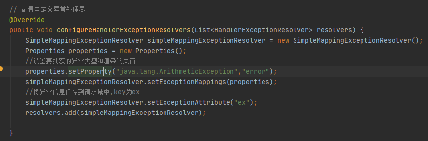

[toc]
# 一、SpringMVC简介
   
## (一)导入：什么是MVC：

## (二)什么是SpringMVC

## (三)SpringMVC的特点

## (四)快速使用：
配置文件方式：
### 1.创建maven工程

### 2.导入依赖

### 3.在src目录下的main包里创建webapp文件夹，并创建xml配置文件，添加springMVC的配置

### 4.创建前端控制器DispatcherServlet配置文件，并在此文件里开启包扫描和配置视图解析器
在springMVC的xml配置文件里指定其位置(也可不指定，则默认查找路径为WEB-INF文件夹下)

### 5.在WEB-INF下创建视图解析器指定的路径文件夹，并创建html文件，在html标签内添加Thymeleaf的命名空间

### 6.创建请求控制器：处理具体请求

(1)创建一个Controller控制层类，并用注解@Controller注解标注
(2)编写具体方法(控制器方法)并添加请求映射注解@RequestMapping(value="")，value值为浏览器输入的路径名称

### 7.编写前端页面，浏览器解析绝对路径需要使用Thymeleaf解析

### 8.总结

注解方式：
# 二、基础功能
    
## (一)注解开发：
### 1.注解：
#### (1)@RequestMapping
##### {1}作用：

##### {2}标注位置不同作用不同：

##### {3}属性：
###### <1>value(使用@RequestMapping必须设置此属性)
####### *1.请求路径，可以设置多个值，可以匹配多个请求地址吗，处理多个请求
####### *2.支持ant风格路径：

####### *3.支持占位符

需要使用注解@PathVariable(value="")标注方法形参接收参数，如果不设置属性值，则默认为属性名；请求路径必须包含参数，否则404

###### <2>method
设置请求方式，除了匹配value值(前提)，还要匹配请求方式，请求才能被控制器方法接收并处理；如果不设置，则表示可以请求所有请求方式

###### <3>params

###### <4>headers

##### {4}派生注解：

@RestController:标注在类上相当于为此类添加了@Controller注解，并为此类的每一个方法标注@ResponseBody注解
##### {5}注意点：
[1]如果不同控制器类中@RequestMapping存在请求地址相同的情况，则报错
            (2)@RequestParam
                详见本章第2.小节获取请求参数的第(2)小节：通过控制器形参自动获取参数第<1>小节
            (3)RequestHeader
                详见本章第2.小节获取请求参数的第(2)小节：通过控制器形参自动获取参数第<2>小节
            (4)@CookieValue
        2.获取请求参数
            <!-- 处理乱码问题(编码不一致)：
                (1)get方式乱码:
                    由tomcat造成，在tomcat文件夹里的conf文件夹里的server.xml配置文件里找到
                        <Connector port="8080" protocol="HTTP/1.1" connectionTimeout="20000" redirectPort="8443"/>
                    添加属性URIEncoding="UTF-8"
                (2)post方式乱码:
                    {1}在过滤器中设置编码，在web.xml中配置过滤器
                        
            -->
            (1)通过ServletAPI获取请求参数
                
            (2)通过控制器形参自动获取参数
                
                <!--  -->
                <1>如果形参和请求参数名不一致，则使用注解@RequestParam("请求参数名")标注形参，标注此注解后，如不传请求参数，则报错，因为此注解的属性required默认值为true，若修改成false：
                    @RequestParam("请求参数名"，required = false)
                则不报错，可配合另一属性defaultvalue在不传请求参数(或传的请求参数为空时)时赋上默认值
                    @RequestParam("请求参数名"，required = false，defaultvalue="默认值")
                    
                <2>使用@RequestHeader获取请求头信息，如请求头信息不存在，则报错，因为此注解的属性required默认值为true，若修改成false：
                     @RequestHeader("请求头信息名"，required = false)
                则不报错，可配合另一属性defaultvalue在请求头信息不存在的情况下赋上默认值
                    
                <3>使用@CookieValue获取cookie信息
                    
            (3)通过实体类POJO获取请求参数
                
                <1>需要创建pojo类，编写属性和有参、无参构造器，get、set方法
        3.域对象共享数据
            <!-- 向Request域对象共享数据 -->
            <!-- 实质上数据最终都封装到了ModelAndView对象中 -->
                (1)使用ServletAPI向request域对象共享数据
                (2)使用ModelAndView类向request域对象共享数据
                    
                (3)通过Model向request域对象共享数据
                    
                (4)使用Map向request域对象共享数据
                    
                (5)使用ModelMap向request域对象共享数据
                    
                (6)Model、ModelMap和Map之间的关系
                    
            <!-- 向session域中共享数据 -->
                (1)使用ServletAPI向session域中共享数据
                    .PNG)
            <!-- 向application域中共享数据 -->
                (1)使用ServletAPI向application域中共享数据
                    .PNG)
        4.HttpMessageConverter(请求报文和响应报文)
            (1)简介：
                
            (2)注解
                {1}@RequestBody
                    <!-- 必须使用post方式提交表单，否则报错 -->
                    
                {2}@ResponseBody
                    <!-- 响应体只能为文本，不能为java对象，可以使用json封装java对象实体信息 -->
                    
                        <1>使用json
                            *1.导入json依赖
                                
                            *2.在SpringMVC的核心配置文件中开启注解驱动
                                <mvc:annotation-driven/>
                            *3.在处理器方法上使用@ResponseBody注解标注
                            *4.将java对象作为返回值返回就会自动转换为json格式的字符串
                                
                        <2>使用ajax
                            *1.导入vue.js和axios.js静态资源包
                                
                            *2.在SpringMVC核心配置文件中开启默认的servlet处理静态资源
                                
                            *3.编写页面
                                
                            *4.编写控制器方法，使用@ResponseBody标注此方法返回响应报文
                                
                {3}RequestEntity
                    <!-- 必须使用post方式提交表单，否则请求体为null -->
                    
                {4}ResponseEntity
                    
                    <!-- 可使用此类型实现文件下载 -->
                        <1>编写下载方法：
                            
                        <2>前台点击超链接获取图片
                    <!-- 可使用此类型实现文件上传 -->
                            
                        <1>导入依赖
                            
                        <2>在SpringMVC的核心配置文件配置文件上传解析器，将上传的文件封装为MultipartFile，id="multipartResolver"为固定写法
                            
                        <3>编写控制器方法
                            
                        <4>文件上传的前端页面
                            
    (二)SpringMVC的视图(View)
            <!--  -->
        1.ThymeleafView
            
        2.转发视图
            
        3.重定向视图
            
        4.视图控制器
            请求没有其他需要处理的逻辑，只要求跳转时，即可在SpringMVC配置文件中设置视图控制器
            
            
    (三)SpringMVC的拦截器
            
        1.拦截器的配置
            
        2.拦截器的使用
            (1)创建一个拦截器的类
                两种方式：
                    {1}实现HandlerInterceptor接口，并重写preHandle、postHandler、afterCompletion三个方法
                        preHandle(HttpServletRequest request, HttpServletResponse response, Object handler)方法中，返回false表示拦截，返回true表示放行，需要放行则返回true
                            
                    {2}继承HandlerInterceptorAdapter父类(过时方式，不推荐使用)
            (2)在SpringMVC核心配置文件中配置拦截器
                三种配置方式
                    {1}拦截所有请求
                        
                    {2}配置具体拦截规则的拦截器
                        
        3.多个拦截器下，设置拦截器的优先级
            (1)
                
            拦截器执行的先后顺序:
                
    (四)异常处理器
        1.简介：
        2.配置自定义异常处理器
            (1)配置文件方式
                
            (2)注解配置方式
                {1}创建自定义异常处理类，使用注解@ControllerAdvice标注
                {2}创建自定义异常处理方法，对应相应的异常，使用注解@ExceptionHandler标注，此注解的value值为对应的异常类型的class类，value值可以有多个，匹配多个异常
                {3}方法形参使用Exception exception和Model model，exception接收异常信息；model将异常信息保存到请求域
                {4}返回值为错误页面的名称
                    

# 三、RESTful
	(一)简介：
        
    (二)实现：
        
    (三)由于浏览器不支持除了GET和POST方式外的请求方式(ajax方式支持除了GET和POST方式外的请求方式，但也只是部分浏览器支持)，所以需要额外配置HiddenHttpMethodFilter过滤器以支持除了GET和POST方式外的请求方式
        1.在web.xml中配置HiddenHttpMethodFilter过滤器，此过滤器的配置映射(filter-mapping)必须在设置编码的过滤器之后(过滤器的过滤顺序)
            
        2.提交方式
            (1)form表单方式：
                必须是post方式且含有hidden属性的input标签：
                
            (2)超链接方式：
                
                
                
# 四、注解配置SpringMVC(不使用web.xml和SpringMVC.xml)
	(一)创建初始化类，替代web.xml
            
        1.创建初始化类，继承AbstractAnnotationConfigDispatcherServletInitializer父类
        2.重写三个方法:
            (1)getRootConfigClasses():获取spring的配置类，返回值为class数组，将spring的配置类添加在数组内，则指定了spring的配置类
                
            (2)etServletConfigClasses():指定SpringMVC的配置类，返回值为class数组，将springMVC的配置类添加在数组内，则指定了springMVC的配置类
                
            (3)getServletMappings():获取DispatcherServlet的映射路径/规则(url-pattern)，返回字符串数组，将url-pattern的规则以字符串形式添加进数组即可
                (url-pattern).PNG)
        3.配置过滤器，重写getServletFilters()方法，返回值是过滤器数组，在此方法内创建过滤器对象，将对象添加在返回的数组内，则配置了过滤器
            
    (二)创建Spring配置类
        1.创建一个类，使用注解@Configuration标注
    (三)创建SpringMVC配置类
        1.创建一个类，使用注解@Configuration标注
            
        2.开启扫描组件：
            使用注解@ComponentScan标注此类
        3.配置视图解析器(thymeleaf)
            在此配置类中写入
                    //配置生成模板解析器
                    @Bean
                    public ITemplateResolver templateResolver(){
                        WebApplicationContext currentWebApplicationContext = ContextLoader.getCurrentWebApplicationContext();
                        ServletContextTemplateResolver servletContextTemplateResolver = new ServletContextTemplateResolver(currentWebApplicationContext.getServletContext());
                        servletContextTemplateResolver.setPrefix("/WEB-INF/templates");
                        servletContextTemplateResolver.setSuffix(".html");
                        servletContextTemplateResolver.setCharacterEncoding("UTF-8");
                        servletContextTemplateResolver.setTemplateMode(TemplateMode.HTML);
                        return servletContextTemplateResolver;
                    }
                    //生成模板引擎并为模板引擎注入模板解析器
                    @Bean
                    public SpringTemplateEngine templateEngine(ITemplateResolver templateResolver){
                        SpringTemplateEngine springTemplateEngine = new SpringTemplateEngine();
                        springTemplateEngine.setTemplateResolver(templateResolver);
                        return springTemplateEngine;
                    }
                    //生成视图解析器并为解析器注入模板引擎
                    @Bean
                    public ViewResolver viewResolver(SpringTemplateEngine springTemplateEngine){
                        ThymeleafViewResolver thymeleafViewResolver = new ThymeleafViewResolver();
                        thymeleafViewResolver.setCharacterEncoding("UTF-8");
                        thymeleafViewResolver.setTemplateEngine(springTemplateEngine);
                        return thymeleafViewResolver;
                    }
            
        4.view-contorller(视图控制器，不开启MVC的注解驱动会使控制器方法的请求映射失效)
            配置类实现WebMvcConfigurer接口，并重写方法addViewControllers(ViewControllerRegistry registry)
                .PNG)
        5.default-servlet-handler(开启对静态资源的访问(开启默认的servlet)，不开启MVC的注解驱动会使控制器方法的请求映射失效)
            配置类实现WebMvcConfigurer接口，并重写方法configureDefaultServletHandling(DefaultServletHandlerConfigurer configurer)
                .PNG)
        6.annotation-driven(MVC的注解驱动，解除使用了试图控制器导致的控制器方法中请求映射失效，配合default-servlet-handler访问控制器映射的方法)：
            使用注解@EnableWebMvc标注此类
        7.文件上传解析器
            在此配置类中写入
                //配置文件上传解析器
                @Bean
                public MultipartResolver multipartResolver(){
                    CommonsMultipartResolver commonsMultipartResolver = new CommonsMultipartResolver();
                    return commonsMultipartResolver;
                }
            
        8.异常处理器
            配置类实现WebMvcConfigurer接口，并重写方法configureHandlerExceptionResolvers(List<HandlerExceptionResolver> resolvers)
                
        9.拦截器
            (1)创建一个拦截器类，实现HandlerInterceptor接口，并重写preHandle、postHandler、afterCompletion三个方法
                preHandle(HttpServletRequest request, HttpServletResponse response, Object handler)方法中，返回false表示拦截，返回true表示放行，需要放行则返回true
            (2)配置类实现WebMvcConfigurer接口，并重写方法addInterceptors(InterceptorRegistry registry)
                
# 五、SpringMVC执行流程
    
	(一)SpringMVC的常用组件
        
    (二)DispatcherServlet的初始化过程
        <!-- DispatcherServlet本质上是一个Servlet，所以天然遵循Servlet的生命周期，所以宏观上是Servlet生命周期来进行调度 -->
        
# 六、扩展功能
